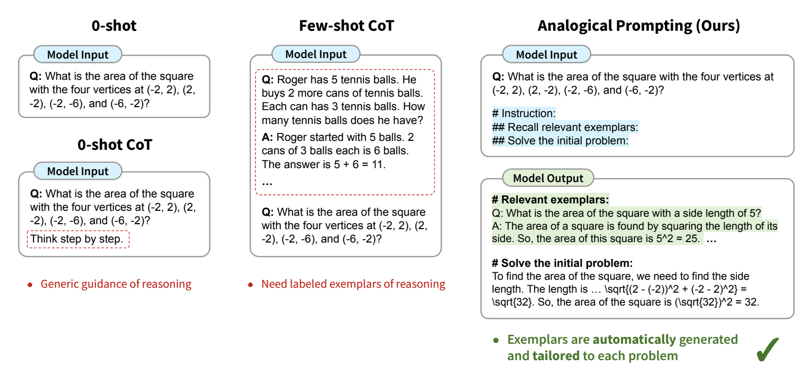

## Analogical Prompting
Analogical prompting is a technique that leverages language models' ability to draw analogies between related problems or concepts, enabling them to generate more relevant and insightful responses to complex queries. This approach is particularly useful for tasks that require reasoning, problem-solving, and knowledge transfer.

### First proposed
Analogical prompting was first proposed in October 2023 in the arXiv preprint, "*Large Language Models as Analogical Reasoners*" ([Citation](#citation)).

### How to use it
To use analogical prompting, add special instructions to the prompt that guide the model to recall or generate relevant examples or knowledge before tackling the main problem.

See ["Prompting"](#prompting) section for usage details.

### When to use it
!!! tip "When to use analogical prompting"
    - Ideal for complex reasoning tasks where drawing parallels to similar problems can aid in problem-solving.
    - Effective in situations that require the application of learned concepts to new scenarios.
    - Particularly useful for mathematical problem-solving, code generation, and other reasoning-intensive tasks.

### What to know
Analogical prompting was inspired by analogical reasoning in psychology, a concept by which humans, when confronted with a new problem, ask themselves if they know the answer to a related problem.

Analogical prompting aims to balance cost and accuracy. Few-shot CoT provides more detailed guidance but demands labeled exemplars of the reasoning process, which can be costly to obtain for every task. This raises a research question: can we achieve the best of both worlds and automate the generation of relevant exemplars to guide LLMs’ reasoning process?

This approach empowers large language models to leverage their broad knowledge base to generate relevant examples and apply analogical reasoning to new problems. By prompting the model to recall or generate related problems and solutions, it can better contextualize and solve the given task.
The process involves two main steps:

Self-generating relevant exemplars or knowledge
Using these exemplars to solve the original problem

This method can be more effective than traditional few-shot prompting as it allows for more tailored and diverse examples.

In benchmarking, analogical prompting resulted in accuracy gains between 2 and 10 percentage points on average over standard zero-shot chain of thought, depending on the specific task.

### Best practices
!!! tip "Best practices for analogical prompting"
    - There are several prompt templates for analogical prompting, choose the one most appropriate for your problem.
    - When working with smaller models consider using retrieval to create exemplars (like [KATE](../few_shot/kate.md)) as larger models tend to be better at the self-generation exmplars required for strong analogical prompting .
    - For complex tasks (ex. code generation), consider prompting the model to generate both high-level knowledge and specific exemplars.
    - The order should be knowledge first, then exemplars.
    - Ensure the model prompt includes a request for distinct and diverse examplars as some models may produce examplars that are too similar to one another.
    - Experiment with the number of self-generated exemplars (3-5 typically work well).
    - Include the '#' symbol in the prompt to help the model structure it's outputs.
    - See ["Prompting"](#prompting) section for more details.

### What to watch out for
!!! important "What to watch out for with analogical prompting"
    - The effectiveness of this approach may vary depending on the scale and capabilities of the base language model.
    - There's a potential for the model to generate irrelevant or incorrect exemplars, which could negatively impact the final solution.
    - The approach requires more computation than simple prompting due to the additional generation steps. Impacts cost.
    - Not all self-generated examplars will be relevant and correct. The athours found that in about a third of self-generated examplars were irrelevant or incorrect. 

### Citation
Yasunaga, M., Chen, X., Li, Y., Pasupat, P., Leskovec, J., Liang, P., Chi, E. H., & Zhou, D. (2023). Large language models as analogical reasoners. [arXiv preprint arXiv:2310.01714](https://arxiv.org/abs/2310.01714). DOI: 10.48550/arXiv.2310.01714.

### Prompting
The analogical prompting template instructs the model to self-generate relevant exemplars or knowledge before solving the main problem. The template typically consists of three main parts:

#### Prompt template
Note that the '#' symbol is part of the prompt and designed to help the model structure its output.

##### Simple template (General)
>\# Problem: {problem} 
\# Relevant problems: Recall three relevant and distinct problems. For each problem, describe it and explain the solution. 
\# Solve the initial problem: 

##### Medium template (Math)
>Your task is to tackle mathematical problems. When presented with a math problem, recall relevant problems as examples. Afterward, proceed to solve the initial problem. 
>
\# Problem: 
An airline serves a dinner to all the passengers on an airplane. They get their choice of steak or fish. Three steak meals and three fish meals are set aside for the six-member crew. If the meals are distributed to the crew members randomly, what is the probability that both pilots get the fish? 
>
\# Instructions: 
\## Relevant Problems: 
Recall three examples of math problems that are relevant to the initial problem. Your problems should be distinct from each other and from the initial problem (e.g., involving different numbers and names). For each problem: 
- After "Q: ", describe the problem 
- After "A: ", explain the solution and enclose the ultimate answer in \boxed{}. 
>
\## Solve the Initial Problem:
Q: Copy and paste the initial problem here.
A: Explain the solution and enclose the ultimate answer in \boxed{} here.

##### Complex template (Code)
> Your goal is to write Python3 code to solve competitive programming problems. 
Given a problem, explain the core concepts in it and provide other relevant problems. Then solve the original problem. 
>
\# Problem: 
{problem} 
>
\# Instruction: 
\## Algorithms: 
Identify the core concepts or algorithms used to solve the problem. 
>
\## Tutorial: 
Write a tutorial about these algorithms. 
>
\## Example Problems: 
Provide three examples of relevant competitive programming problems that involve these algorithms. For each problem, describe the problem, explain the solution in detail, and then write the correct Python3 code. 
>
\## Python3 code to solve the original problem: 
- Explanation of the solution: 
- Python3 code to solve the problem: 