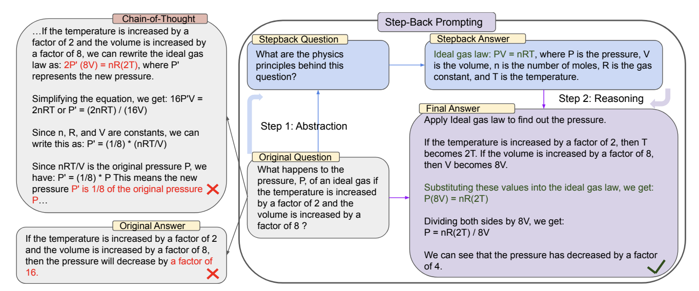

## Overview
Step-back Prompting is a technique that asks large language models (LLMs) to perform abstractions to derive high-level concepts and first principles from instances containing specific details. By using these concepts and principles to guide reasoning, LLMs may be able to better follow a correct reasoning path towards a solution.

## First proposed
Step-back Prompting was proposed in October 2023 by Huaixiu Steven Zheng, Swaroop Mishra, Xinyun Chen, Heng-Tze Cheng, Ed H. Chi, Quoc V Le, and Denny Zhou in the paper ["Take a Step Back: Evoking Reasoning via Abstraction in Large Language Models"](https://arxiv.org/abs/2310.06117).

## How to use it
Step-back Prompting involves two main steps when interacting with an LLM:

1. The step-back prompt
    - Prompt the language model with a step-back question asking it to reason about the principles at play in a solution rather than the solution itself.
    - Have the language model respond with relevant facts about the high-level concept or principle.

2. The reasoning prompt
    - Pass the principles from the step-back prompt along with the original question to the language model.
    - Have the model produce a final solution.

See ["Prompting"](#prompting) and section for usage details.

## When to use it
!!! tip "When to use Step-back Prompting"
    - Ideal for complex tasks that benefit from abstracting to higher-level concepts or principles before reasoning about specifics.
    - Effective for knowledge-intensive questions where recalling general information first can help guide the specific answer.
    - Particularly useful for multi-step reasoning tasks where breaking down the problem into abstract concepts can simplify the reasoning process.
    - Applicable across various domains including STEM, knowledge QA, and multi-hop reasoning tasks.

## What to know
Step-back Prompting is a technique that aims to improve language model reasoning by mimicking the human process of abstraction. The method involves two key steps: Stepping back, where the LLM generates a more abstract question related to the original query, and Reasoning, where the LLM uses information from the abstract question to guide its reasoning on the original query. This approach is designed to help language models identify relevant high-level concepts and principles before attempting to solve specific problems.



The technique is based on the idea that abstracting complex problems can reduce cognitive load and activate relevant knowledge that might not be immediately apparent from specific details. The authors found that a single demonstration example was typically sufficient for language models to learn the abstraction process, suggesting that this skill is relatively easy for these models to acquire through in-context learning. While the approach showed improvements across various tasks such as STEM problems and QA knowledge and model families, it's important to note that performance gains may vary depending on the specific task and model used. Notably, the approach was only tested on large language models of 70 billion parameters and up, leaving its effectiveness on smaller models an open question.

## Replication
I conducted a partial replication using the 151-question MMLU high-school physics dataset also used by Zheng et al. The replication tested Step-back Prompting against traditional Chain-of-Thought (CoT) prompting across three models of various sizes from different providers not tested in the original paper.

The full code and project files used for the replication are available [here](https://github.com/jjmacky/lm-toolkit/tree/main/code/prompt_dictionary/cot/step_back). The main Python notebook is available [here](https://github.com/jjmacky/lm-toolkit/blob/main/code/prompt_dictionary/cot/step_back/step_back.ipynb).

### Methodology
1. Step-back prompts were constructed with one exemplar, following the findings of Zheng et al.
2. These prompts were used to elicit principles for each of the 151 physics questions, following Table 7 in Section C.1 of the original paper.
3. The elicited principles, original questions, and a complete exemplar were then passed to the model for a final answer, as per Table 8 in Section D.1.
4. Claude Sonnet 3.5 was used as a judge to determine if the model solution matched the original solution.

### Results
Contrary to the findings in the original paper, Step-back Prompting did not consistently outperform traditional CoT in this replication. Notably, for GPT-3.5 Turbo, Step-back Prompting performed 10 percentage points worse than standard CoT.

| Model  | Step Back Accuracy | Standard CoT Accuracy |
|--------|---------------------|-------------------|
| Llama3 (8B) | 22.5%               | 20.5%             |
| Gemini Flash | 58.9%               | 61.6%             |
| GPT-3.5 Turbo    | 33.1%               | 43.0%             |

These results suggest that the effectiveness of Step-back Prompting may vary depending on the specific model and task, and may not generalize uniformly across all large language models.

## Best practices
!!! tip "Best practices for Step-back Prompting"
    - Provide clear instructions for both the abstraction and reasoning steps.
    - Use few-shot examples to demonstrate the desired abstraction and reasoning process (the authors found that one exemplar is sufficient).
    - Consider combining Step-back Prompting with other techniques like retrieval-augmented generation (RAG) for knowledge-intensive tasks.
    - Implement error handling and validation to manage potential issues in the abstraction or reasoning steps.
    - Ensure that the abstraction step doesn't introduce errors or biases not present in the original query.

## What to watch out for
!!! warning "What to watch out for with Step-back Prompting"
    - The quality of the abstraction can significantly impact the final answer. Poor abstractions may lead to irrelevant or misleading reasoning.
    - Some simple queries may not benefit from abstraction and could be answered more efficiently directly.
    - The technique may require more computation time and resources compared to direct questioning, especially for complex tasks.
    - Performance improvements may vary depending on the specific task and model used.
    - There's a risk of over-abstraction, potentially losing important details from the original query.

## Citations
Zheng, H. S., Mishra, S., Chen, X., Cheng, H. T., Chi, E. H., Le, Q. V., & Zhou, D. (2024). Take a Step Back: Evoking Reasoning via Abstraction in Large Language Models. [arXiv preprint arXiv:2310.06117v2](https://arxiv.org/abs/2310.06117).

## Prompting
The Step-back Prompting template instructs the model to first generate a more abstract question related to the original query, and then use this abstraction to guide its reasoning. The template consists of two main parts:
1. Step-back prompt:
- Ask the model to generate a more general or high-level question related to the original query.

2. Instructions for reasoning:
- Instruct the model to use the information from the abstract question to answer the original query.

### Prompt template
#### STEM physics example
##### 1. Step-back prompt
> You are an expert at Physics.<br>
> You are given a Physics problem.<br>
> Your task is to extract the Physics concepts and principles involved in solving the problem.<br>
><br>
> Here is an example: {exemplar}<br>
><br>
> Question: {question}<br>
> Do not solve the problem. Only detail the principles and equations involved.<br>
> Principles Involved:<br>

##### 2. Reasoning prompt
> You are an expert at Physics.<br>
> You are given a Physics problem and a set of principles involved in solving the problem.<br>
> Solve the problem step by step by following the principles.<br>
><br>
> Here is an example: {exemplar}<br>
><br>
> Question: {question}<br>
> Principles Involved: {result from step-back prompt}<br>
> Solution:<br>

#### Knowledge QA example
##### 1. Step-back prompt
> You are an expert at world knowledge.<br>
> Your task is to step back and paraphrase a question to a more generic step-back question, which is easier to answer.<br>
><br>
> Here is an example: {exemplar}<br>
><br>
> Question: {question}<br>
> Do not solve the problem. Only detail the principles involved.<br>
> Principles Involved:<br>

##### 2. Reasoning prompt
> You are an expert of world knowledge.<br>
> I am going to ask you a question.<br>
> Your response should be comprehensive and not contradicted with the following context if they are relevant.<br>
> Otherwise, ignore them if they are not relevant.<br>
><br>
> Here is an example: {exemplar}<br>
><br>
> {optional additional retrieved info from database}<br>
> Question: {question}<br>
> Supporting question {result from step-back prompt}<br>
> Answer:<br>

### API example
```python
from openai import OpenAI

exemplar_question = "A microwave oven is connected to an outlet, 120 V, and draws a current of 2 amps. At what rate is energy being used by the microwave oven?"

exemplar_principles = """
The physics principles behind this question relate to electrical power and energy consumption. Here are the relevant principles and equations:

1. Ohm's Law: This fundamental principle relates voltage (V), current (I), and resistance (R) in an electrical circuit.
   V = I * R

2. Electrical Power: The rate at which electrical energy is transferred or converted in a circuit is given by the power equation.
   P = V * I
   Where:
   P is power in watts (W)
   V is voltage in volts (V)
   I is current in amperes (A)

3. Energy and Power Relationship: Energy is the capacity to do work, while power is the rate at which energy is transferred or work is done.
   E = P * t
   Where:
   E is energy in joules (J)
   P is power in watts (W)
   t is time in seconds (s)

4. Unit Conversions: Understanding the relationships between different units of power and energy might be relevant.
   1 kilowatt (kW) = 1000 watts (W)
   1 kilowatt-hour (kWh) = 3,600,000 joules (J)

5. Conservation of Energy: The principle that energy cannot be created or destroyed, only converted from one form to another. In this case, electrical energy is being converted to other forms (primarily heat and electromagnetic waves) in the microwave oven.

These principles and equations provide the foundation for calculating the rate at which energy is being used by an electrical appliance given its voltage and current draw.
"""

exemplar_solution = """
Let's solve this problem step by step using the principles.

Given:
- Voltage (V) = 120 V
- Current (I) = 2 A

We need to find the rate at which energy is being used, which is equivalent to the power consumed by the microwave oven.

Step 1: Use the electrical power equation to calculate the power.
P = V * I
P = 120 V * 2 A
P = 240 W

Therefore, the microwave oven is using energy at a rate of 240 watts.

To express this in kilowatts, we can convert:
240 W = 0.24 kW

Conclusion: The microwave oven is using energy at a rate of 240 watts or 0.24 kilowatts.
"""

current_question = "The plates of a capacitor are charged to a potential difference of 5 V. If the capacitance is 2 mF, what is the charge on the positive plate?"

get_principles_prompt = f"""
You are an expert at Physics.
You are given a Physics problem.
Your task is to extract the Physics concepts and principles involved in solving the problem.
Here is an example:

--- Example ----
Question: {exemplar_question}
Principles:{exemplar_principles}
--- End of Example ----

Question: {current_question}
Do not solve the problem. Only detail the principles and equations involved.
Principles Involved:
"""

def call_gpt(prompt):
	completion = openai_client.chat.completions.create(
		model="gpt-3.5-turbo",
		messages=[
			{"role": "user", "content": prompt}
		]
	)
	return completion.choices[0].message.content


current_principles = call_gpt(get_principles_prompt)

get_step_back_solution_prompt = f"""
You are an expert at Physics.
You are given a Physics problem and a set of principles involved in solving the problem.
Solve the problem step by step by following the principles.
Here is an example:

--- Example ----
Question: {exemplar_question}
Principles:{exemplar_principles}
Solution: {exemplar_solution}
--- End of Example ----

Question: {current_question}
Principles Involved: {current_principles}
Solution: 
"""

final_solution = call_gpt(get_step_back_solution_prompt)
print(final_solution)
```
