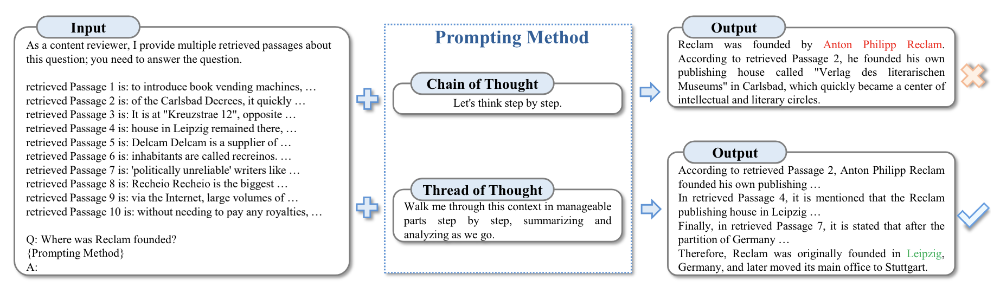
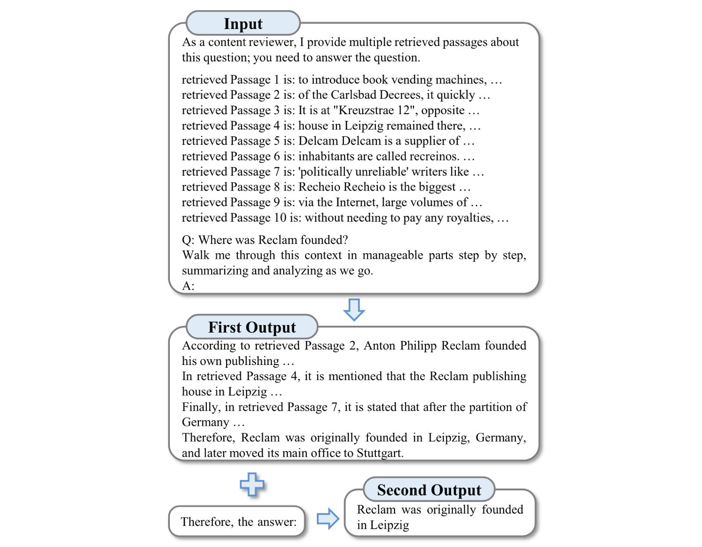

## Overview
Thread-of-Thought (ThoT) is a technique designed to enhance the performance of Large Language Models (LLMs) in processing chaotic contextual information. This method draws inspiration from human cognitive processes, enabling LLMs to systematically segment and analyze extended contexts while adeptly selecting pertinent information.

## First proposed
ThoT was proposed in November 2023 by Yucheng Zhou, Xiubo Geng, Tao Shen, Chongyang Tao, Guodong Long, Jian-Guang Lou, and Jianbing Shen in the paper, ["Thread of Thought Unraveling Chaotic Contexts"](https://arxiv.org/abs/2311.08734).

## How to use it
Thread-of-Thought involves two main interactions with a large language model:

**Interaction 1: Initial Analysis**

- Provide the LLM with the original query and context.
- Instruct the model to analyze the context in manageable parts, step by step.
- The model generates a structured analysis of the context.

**Interaction 2: Final Answer Generation**

- Based on the structured analysis from Interaction 1, instruct the model to provide a final answer.
- The model produces the final result.

See ["Prompt template"](#prompt-template) section for usage details.

## When to use it
!!! tip "When to use Thread-of-Thought (ThoT)"
    Based on the evaluation of ThoT in the [main paper](#first-proposed) the use cases are as follows. However, note that I was not able to independently verify the reportedly strong performance of Thot (see ["Replication"](#replication) section).

    - Ideal for tasks involving extended, chaotic contexts, such as retrieval-augmented generation and multi-turn conversations.
    - Effective in situations where the context contains a mix of relevant and irrelevant information.
    - Particularly useful for queries that require synthesizing information from multiple sources or long contexts.

## What to know
The Thread-of-Thought (ThoT) technique introduces the concept of "Chaotic Context" in natural language processing. Unlike "Long Context," which primarily concerns input length, Chaotic Context refers to the complexity and diversity of information within an input. It typically comprises a mixture of related and unrelated data from various sources, each with varying relevance to the task at hand.

ThoT modifies the Chain of Thought (CoT) prompting method and comes in two versions: single-stage and two-stage. In the single-stage version, ThoT simply replaces the standard CoT prompt "Let's think step by step" with "Walk me through this context in manageable parts step by step, summarizing and analyzing as we go." The authors report that this specific phrasing, selected from 30 candidate prompts, performed best in their experiments.

The technique employs a two-step approach:


1. Systematic Context Analysis: The model divides the input into smaller segments for individual analysis.
2. Information Synthesis: The model uses the segmented analysis to construct a final answer.



This process aims to emulate human cognitive strategies for handling complex information. By segmenting the input, identifying key points, and maintaining analytical focus, ThoT attempts to improve the model's ability to process complex informational inputs.

## Replication

The authors of the ThoT paper present results from experiments using various datasets, including PopQA, EntityQ, and a custom Multi-Turn Conversation Response (MTCR) dataset. They report performance improvements compared to other prompting techniques. However, the paper lacks sufficient information for a full study replication. Crucial details, such as which dataset was used for retrieval to create the "chaotic context" or how to access the custom MTCR dataset, are not provided. Consequently, independent verification of the results was not possible.

Instead, to gain insights into the ThoT technique's effectiveness, I conducted a small-scale replication study in collaboration with Claude Sonnet 3.5. We created two synthetic "chaotic contexts" and tested the ThoT prompt strategy on Llama 3 (8B). While detailed evaluation information from the original paper is not available for full replication, our synthetic contexts align with the information that can be gleaned about the evaluation from the paper itself (e.g., see the "Input" box in the image from the ["What to Know"](#what-to-know) section showing 10 retrieved passages).

All project files used for this analysis are available on Github [here](https://github.com/jjmacky/lm-toolkit/tree/main/code/prompt_dictionary/cot/thot).

The first chaotic context is based on Roman history:

> Based on the following information, who was the leader of the group that conquered the city where the last Western Roman Emperor ruled?
>
> - The city of Ravenna, located in Italy, became the capital of the Western Roman Empire in 402 CE.
> - Julius Caesar crossed the Rubicon river in 49 BCE, sparking a civil war.
> - Romulus Augustulus began his reign as Western Roman Emperor in 475 CE.
> - The Ostrogothic king Theoderic the Great defeated Odoacer in 493 CE.
> - Constantinople fell to the Ottoman Turks in 1453 CE, ending the Byzantine Empire.
> - The last Western Roman Emperor was deposed in 476 CE.
> - Odoacer, a Germanic chieftain, took control of Italy in 476 CE.
> - The Visigoths sacked Rome in 410 CE under the leadership of Alaric I.
> - Romulus Augustulus ruled from the city of Ravenna until his deposition.
> - The Vandals captured the city of Carthage in 439 CE.

The correct answer is Odoacer. This is a multi-hop question, which involves connecting the following pieces of information to arrive at the correct answer:

1. Identify Romulus Augustulus as the last Western Roman Emperor (combining information from points 3 and 6).
2. Determine that Ravenna was where he ruled (from point 9) and that Ravenna is in Italy (from point 1).
3. Identify Odoacer as the leader who took control of Italy in 476 CE, the year the last emperor was deposed (from point 7).

Because the model may have memorized some information about Roman history, which would give standard prompting an advantage relative to ThoT for the first chaotic context, I also included a second context based on facts from a 3 July 2024 news article about Japanese regulation concerning the phase-out of floppy disks ([Link](https://arstechnica.com/gadgets/2024/07/japans-government-finally-exits-90s-ends-floppy-disk-use/)).

> Based on the following information, in what year did the Japanese government stop requiring physical media for business filings and citizen submission forms?
>
> - Japan's Digital Agency was established during the COVID-19 pandemic to modernize government technology.
> - Digital Minister Taro Kono declared a "war on floppy disks" about two years ago.
> - The US Air Force used 8-inch floppies until 2019.
> - As of June 28, 2024, Japan's government eliminated the use of floppy disks in all its systems, except for one environmental regulation.
> - Two years before the complete elimination of floppy disks, the government stopped requiring physical media for 1,900 types of submissions.
> - The Institute for Management Development's 2023 World Digital Competitiveness Ranking listed Japan as number 32 out of 64 economies.
> - Many workplaces in Japan still opt for fax machines over emails.
> - Sony, the last company to manufacture floppy disks, stopped production in 2011.
> - Floppy disks typically had a storage capacity that maxed out at 1.44MB, with some versions reaching 2.88MB.
> - Chuck E. Cheese was reported to be using floppy disks for its animatronics as recently as January 2023.

Three different prompts were used in evaluation:

1. A version with no additional direction.
2. A version with a chain of thought direction ("Let's think step by step").
3. A version with a thread of thought direction ("Walk me through this context in manageable parts step by step, summarizing and analyzing as we go.").

Each prompt version for both chaotic contexts was passed to Llama 3 (8B) ten times. The results are summarized in the following table:

| Chaotic Context       | Vanilla Prompting (n=10) | Standard Chain of Thought (n=10) | Thread of Thought (two-stage) (n=10) |
|-----------------------|--------------------------|----------------------------------|--------------------------------------|
| Roman History         | 100%                     | 100%                             | 60%                                  |
| Japanese Floppy Disks | 100%                     | 90%                              | 70%                                  |

Surprisingly, vanilla prompting performed best, producing the most concise and accurate answers. Chain of Thought prompting also performed well. Thread of Thought prompting, however, performed the worst, scoring just 60% on the Roman History context and 70% on the Japanese Floppy Disk context. ThoT's responses were also the longest and most difficult to follow.

ThoT prompting did benefit from its two-stage approach, where some logic and calculations that could have been done in the first stage were completed in the second. For instance, in the Japanese Floppy Disks context, the model often offloaded the calculation that 2022 was two years before 2024 to the second stage.

Much of ThoT's poor performance seemed to stem from the prompt's wording, particularly the phrase "analyzing as we go," which frequently caused the model to interrupt its analysis and ask for next steps. An example of this behavior is provided for the Roman history context.

> Let's break down the information into manageable chunks and analyze it together. Here's a summary of the first few points:
>
> **Part 1: Background Information**
>
> - The Western Roman Empire had its capital in Ravenna, Italy, from 402 CE.
> - Julius Caesar crossed the Rubicon river in 49 BCE, sparking a civil war (this point is likely included to provide historical context).
> - Romulus Augustulus began his reign as Western Roman Emperor in 475 CE.
>
> **Analysis**
>
> At this stage, we know that Ravenna was the capital of the Western Roman Empire and that Romulus Augustulus took over as emperor in 475 CE. This sets the stage for what's to come. Caesar's crossing of the Rubicon river is a significant event in Roman history, but it's not directly relevant to the fall of the Western Roman Empire.
>
> **Next Steps**
>
> Let's move on to the next point:
>
> - The last Western Roman Emperor was deposed in 476 CE.
>
> What do you think might happen next?

While a full replication of the original study is not possible due to missing information, this small-scale replication was unable to demonstrate the benefits of ThoT as reported in the original paper. Further investigation and more comprehensive testing would be necessary to fully understand the potential advantages and limitations of the ThoT technique.

### Best practices
!!! tip "Best practices for with Thread-of-Thought (ThoT)"
    - Use the specific ThoT prompt wording that encourages step-by-step analysis and summarization of the context.
    - ThoT's reported effectiveness across model sizes suggests it could be useful regardless of model size.
    - Implement error handling and validation to manage potential issues with context analysis or answer generation.
    - For complex tasks, consider multiple iterations of analysis and synthesis if initial results are unclear.

### What to watch out for
!!! warning "What to watch out for with Thread-of-Thought (ThoT)"
    - Because the paper did not provide links or access to the necessary data, a thorough replication of the evaluations reported in the ThoT paper was not possible. However, in a small-scale replication attempt, ThoT did not perform well (see ["Replication"](#replication) Section above).
    - In my experimentation ThoT responses tend to be long and difficult to follow which may require additional parsing logic to determine the final answer.
    - The two-stage version of the technique requires two separate interactions with the model, which may increase computation time and costs.
    - ThoT may struggle with tasks requiring implicit reasoning or understanding nuanced relationships.
    - The method may not provide benefits for simple, straightforward queries where a detailed analysis is unnecessary.

## Citations
Zhou, Y., Geng, X., Shen, T., Tao, C., Long, G., Lou, J. G., & Shen, J. (2023). Thread of Thought Unraveling Chaotic Contexts. [arXiv preprint arXiv:2311.08734](https://arxiv.org/abs/2311.08734).

## Prompting
The main Thot prompting strategy involves two-stages, first requesting the model to output an analysis using the ThoT prompt and then extracting the final answer from the analysis. However, the authors do mention that the Thot prompt can be tried as a stand-alone single-turn prompting strategy.

### Prompt template
#### One-stage prompting version
> Walk me through this context in manageable parts step by step, summarizing and analyzing as we go.<br>
> Context: {context}<br>
> Query: {query}<br>

#### Two-stage prompting version
**PROMPT 1:**
> Walk me through this context in manageable parts step by step, summarizing and analyzing as we go.<br>
> Context: {context}<br>
> Query: {query}<br>

**PROMPT 2:**
> {result of Prompt 1} <br>
> Based on the above analysis, please provide a final answer to the query.<br>
> Query:<br>


### API example
```python
import ollama

def question_answerer(context, prompt):
    model = 'llama3'
    messages = [
        {
            'role': 'user',
            'content': context + "\n\n" + prompt
        }
    ]

    # Make the request to the Ollama API
    response = ollama.chat(model=model, messages=messages, stream=False)
    return response["message"]["content"]

# Stage 1: Get initial summary
chaotic_context = """Based on the following information, who was the leader of the group that conquered the city where the last Western Roman Emperor ruled?

- The city of Ravenna, located in Italy, became the capital of the Western Roman Empire in 402 CE.
- Julius Caesar crossed the Rubicon river in 49 BCE, sparking a civil war.
- Romulus Augustulus began his reign as Western Roman Emperor in 475 CE.
- The Ostrogothic king Theoderic the Great defeated Odoacer in 493 CE.
- Constantinople fell to the Ottoman Turks in 1453 CE, ending the Byzantine Empire.
- The last Western Roman Emperor was deposed in 476 CE.
- Odoacer, a Germanic chieftain, took control of Italy in 476 CE.
- The Visigoths sacked Rome in 410 CE under the leadership of Alaric I.
- Romulus Augustulus ruled from the city of Ravenna until his deposition.
- The Vandals captured the city of Carthage in 439 CE."""

thot_prompt = "Walk me through this context in manageable parts step by step, summarizing and analyzing as we go."

summary_response = question_answerer(chaotic_context, thot_prompt)

# Stage 2: Get final answer
final_answer_prompt = "\n\n Based on the above summary, who was the leader of the group that conquered the city where the last Western Roman Emperor ruled? \n Answer:"

final_answer = question_answerer(summary_response, final_answer_prompt )
print(final_answer)
```