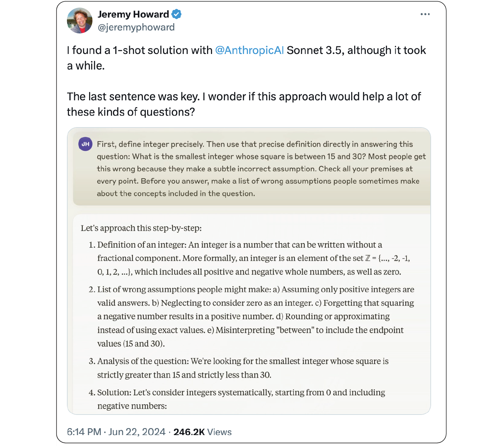
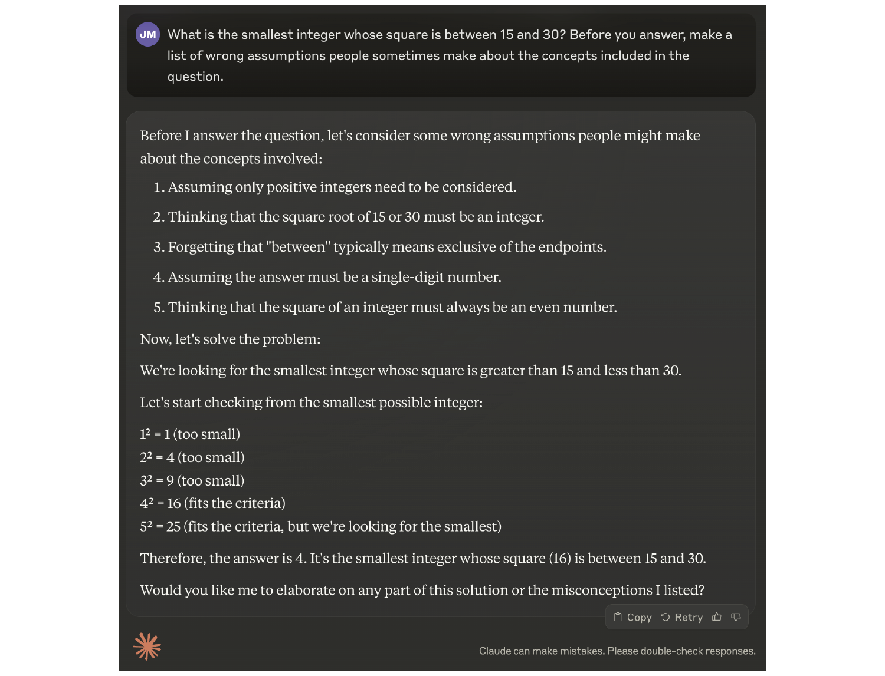

## Assumption consideration prompting
Assumption consideration encourages a language model to think about common incorrect assumptions before attempting to solve a problem. [It was proposed by Jeremy Howard in June of 2024 on the X social media platform](https://x.com/jeremyphoward/status/1804639001934225800).

!!! Important
    Assumption consideration has not been rigorously validated as it was put forth as an experimental idea by Howard.

### How to use it
Simply append a statement to the end of the prompt asking the model to list incorrect assumptions made about similar problems.

### When to use it
!!! tip "Know when to use assumption consideration"
    - When a problem has subtle assumptions that can easily be missed, for instance considering negative numbers in a math problem about finding the smallest number in a family of solutions.

### What to know
[Assumption consideration was proposed by Jeremy Howard in June of 2024 on the X social media platform](https://x.com/jeremyphoward/status/1804639001934225800) in response to [Eric Neyman's challenge](https://x.com/ericneyman/status/1804168604847358219) to have a language model correctly answer the question, "What is the smallest integer whose square is between 15 and 30?"

Howard later shortened the assumption consideration prompt to:
> Before you answer, make a list of wrong assumptions people sometimes make about the concepts included in the question.

#### Criticism
The specific challenge from Neyman could be considered ill-posed. User [Joseph Sirosh pointed out](https://x.com/josephsirosh/status/1804892400982298821) that one could simply bypass the need for assumption consideration by rephrasing the question more directly. "Words like smallest and least in natural language deal with magnitudes. Yes, -5 is most negative, but is -5 "smaller" than 4? If you ask the correct question in the first place: "what is the most negative integer..." you'll get a correct answer 0-shot."

### Best practices
!!! tip "Best practices for assumption consideration"
    - Assumption consideration may have limited use cases, don't overuse it.
    - As this method has not been rigorously tested, try different versions of the prompt for yourself.

### What to watch out for
!!! warning "What to watch out for with assumption prompting"
    - Assumption consideration may not always work. In my testing with Claude Sonnet 3.5, the method did not work on the first try, despite Claude identifying the common assumption of only considering positive integers.

### Citations
- [Jeremy Howard, 22 June 2024, X social media platform](https://x.com/jeremyphoward/status/1804639001934225800)

### Prompting
#### Prompt template
Emotion prompting has a very simple prompt template that involves adding an emotional appeal to the end of a question or instruction to the language model. See example emotional appeals above.

> {prompt}  
> "Before you answer, make a list of wrong assumptions people sometimes make about the concepts included in the question."  
