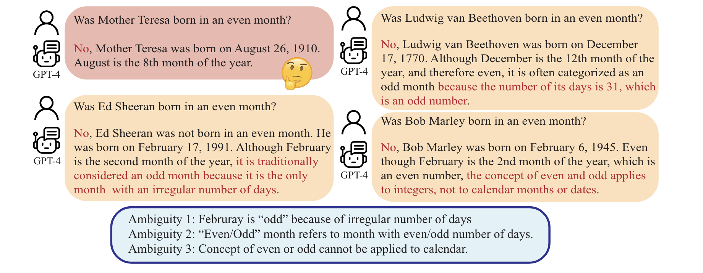

## Rephrase and Respond (RaR)
Rephrase and Respond (RaR) is a prompting technique where a language model is asked to rephrase and expand upon a given question before providing an answer. This approach aims to improve the language model's understanding of the question and its ability to provide accurate and relevant responses.

### How to use it
To use RaR use a refinement phrase to ask the model to rephrase the question. Then using the rephrased question the model returns, ask the question again.

[See "Prompting" section for usage details](#prompting).

### When to use it
!!! tip "When to use rephrase and respond"
    - Contexts that naturally contain ambiguity or different ways to interpret the same concept.
    - Situations where the original question may be poorly phrased or lacks necessary context, for example if third-party sources are controlling the input text.
    - Domains where misinterpretation of the question could lead to significant errors (e.g., medical, legal, or financial inquiries).

### What to know
By rephrasing and expanding upon the question, the language model has the opportunity to clarify any ambiguities, add relevant context, and ensure that it has a thorough understanding of what is being asked. This can lead to more accurate and informative responses.

RaR has both a single-stage and two-stage version of the prompting framework. In the single-stage version the language model is given a question along with the instruction to rephrase, expand upon, and answer the question.

In the two-stage version the first prompt asks the language model to rephrase the question. The second prompt then uses this rephrased version to provide an answer. This could be the same language model or two different language models.

Deng et al. (2023), who introduced the RaR concept, discuss ambiguities in questions that can lead to misinterpretation by language models. For example, when asking whether famous people were born in even or odd months, there are several definitions of "odd" that the model might consider, such as:

- Months with an odd number of days
- Months that are not evenly divisible by two (e.g., February)
- Months that are not typically referred to as even or odd

These ambiguities are outlined in this diagram from their paper:



### Best practices
!!! tip "Best practices for rephrase and respond"
    - Keep the prompting instruction concise and clear. Try using one of the refinement phrases in the ["Prompting" section](#prompting).
    - In the two-step version of RaR instruct the model to only return the rephrased question without answering it.
    - Add the refinement phrase to the end of the main instruction or query to the language model.
    - RaR can potentially be combined with other prompting techniques like chain-of-thought reasoning for additional performance gains.
    - When using the two-step RaR version, a more capable language model can be used for the rephrasing step to clarify questions for a less advanced answering model.

### What to watch out for
!!! warning "What to watch out for with rephrase and respond"
    - Has a narrow use case of questions that have an ambiguous interpretation, but can nonetheless be rephrased in a narrow, concise manner.
    - Additional parsing logic may be required as the model may add a preamble such as: "Here is the unbiased text context, excluding the user's bias and preference:" to the rephrased question.
    - Instructing the model to rephrase very ambiguous questions like "What is art?" may result in long, complex restatements that attempt to encompass in detail all possible interpretations.
    - The quality of the model's rephrasing ability is important. Less capable models may introduce errors or misinterpretations during the rephrasing step.
    - There is a risk of the model hallucinating information during the rephrasing step that alters the intent of the original question.
    - RaR adds an extra step of latency compared to simply answering the original question. The tradeoff between accuracy and speed should be considered for time-sensitive applications.

### Citations
Deng, Y., Zhang, W., Chen, Z., & Gu, Q. (2023). Rephrase and Respond: Let Large Language Models Ask Better Questions for Themselves. [arXiv preprint arXiv:2311.04205](https://arxiv.org/abs/2311.04205).

### Prompting
#### Prompt template
The RaR prompt template has two versions. 

##### One-step version
> {refinement phrse} <br>
> {question} <br>

One-step refinement phrases can include:

- "Rephrase and expand the question, and respond."
- "Reword and elaborate on the inquiry, then provide an answer."
- "Reframe the question with additional context and detail, then provide an answer."
- "Modify the original question for clarity and detail, then offer an answer."
- "Restate and elaborate on the inquiry before proceeding with a response."

##### Two-step version
The two-step RaR separates the rephrasing and answering steps into two prompts. First, a refinement phrase is added to the end of a question or instruction. The model then responds with an improved restatement of the original prompt. Then, the restated question is then used to produce the final answer.

Prompt 1:
> {question} <br>
> {refinement phrase} <br>

Prompt 2:
> {Rephrased prompt} <br>

Two-step refinement phrases can include:

- "Rephrase and expand the question."
- "Reword and elaborate on the inquiry."
- "Reframe the question with additional context and detail."
- "Modify the original question for clarity and detail."

#### Prompt Examples
##### One-step version
Let's ask the model, "What is the largest city in the world?" This can be ambiguous depending on whether you are measuring by population, area, or metropolitan area. The model should pick one definition and provide it.
> Question: What is the largest city in the world?
>
> Rephrase and expand the question, then respond.

Model response (Llama 8B)
> Rephrased question:
> 
> What is the most populous urban agglomeration (city proper or metropolitan 
> area) in the world, considering both the number of inhabitants within the 
> defined city limits as well as the broader metropolitan region?
> 
> Expanded explanation:
> 
> When determining the largest city in the world, it's essential to consider 
> two factors: the population within the city's administrative boundaries 
> (also known as the "city proper") and the broader metropolitan area. The 
> city proper refers to the urban core, whereas the metropolitan area 
> encompasses a larger geographic region that includes surrounding cities, 
> towns, and suburbs.
> 
> Response:
> 
> According to various sources, including the United Nations Department of 
> Economic and Social Affairs Population Division and the Citypopulation.de 
> website, the largest city in the world is Tokyo-Yokohama Metropolitan 
> Area, with a population of over 38 million people as of 2021. The city 
> proper (Tokyo) has approximately 13.9 million inhabitants, while the 
> metropolitan area includes surrounding cities like Yokohama, Kawasaki, and 
> Saitama.
> 
> Tokyo's massive size can be attributed to its unique urban development 
> patterns, including:
> 
> 1. High population density: Tokyo is one of the most densely populated 
> cities globally.
> 2. Urban sprawl: The city has expanded rapidly over the years, 
> incorporating surrounding areas into its metropolitan region.
> 3. Strong economic growth: Tokyo is a global financial hub and a center 
> for innovation, driving urbanization and migration.
> 
> Other notable large cities include:
> 
> 1. Delhi-NCR (National Capital Region), India: With a population of around 
> 29.2 million in the city proper and over 46 million in the metropolitan 
> area.
> 2. Shanghai, China: The city proper has approximately 24.1 million 
> inhabitants, while the metropolitan area has over 34 million people.
> 3. Mexico City, Mexico: The city proper has around 21.8 million 
> inhabitants, while the metropolitan area has over 25 million people.
> 
> Keep in mind that population figures may vary depending on the source and 
> methodology used to define the city's boundaries.

##### Two-stage RaR:
Rephrasing Prompt:
> Rephrase and expand the question to help provide a better answer. Maintain all information from the original question. Provide only the rephrased question without answering it. Question: What is the first day of the week?

Model response (ChatGPT 4o):
> Can you please tell me which day is considered the first day of the week in different cultural or regional contexts?

Answering Prompt (using the rephrased question from the previous step):
> Can you please tell me which day is considered the first day of the week in different cultural or regional contexts?

Model response (Llama 8B):
> What a great question!
>
> The answer varies across cultures, regions, and even languages. Here's a 
> breakdown:
>
> 1. **International Standard**: In international standard ISO 8601, Monday 
> is considered the first day of the week.
> 2. **English-speaking countries**: In most English-speaking countries, 
> including the United States, Canada, Australia, and the UK, Sunday is 
> typically considered the first day of the week.
> 3. **Christian tradition**: In Christian tradition, Sunday is often 
> referred to as the "Lord's Day" or the first day of the week, following 
> biblical accounts of Jesus' resurrection on a Sunday.
> 4. **Islamic tradition**: In Islamic tradition, Friday is considered the 
> first day of the week, and it's known as Jumu'ah (جمعة).
> 5. **Hebrew calendar**: In the Hebrew calendar used in Jewish traditions, 
> Saturday (Shabbat) is considered the first day of the week.
> 6. **Eastern Orthodox tradition**: In Eastern Orthodox tradition, Sunday 
> is the first day of the week.
> 7. **Latin American and some European countries**: In some Latin American 
> countries, such as Mexico and Brazil, Monday is considered the first day 
> of the week. Similarly, in some European countries like Germany, Austria, 
> and Switzerland, Wednesday or Thursday can be considered the first day of 
> the week.
> 8. **Arabic-speaking countries**: In many Arabic-speaking countries, 
> including Egypt, Saudi Arabia, and Iraq, Sunday is considered the first 
> day of the week.
> 9. **Indian context**: In India, where there are multiple calendars in use 
> (e.g., Hindu, Muslim, Christian), different days can be considered the 
> first day of the week depending on the community or region.
>
> It's fascinating to see how different cultures and regions have their own 
> interpretations of what constitutes the "first" day of the week.


### API examples
One-stage RaR:
```python
from openai import OpenAI
import ollama

# Set your API key
client = OpenAI(
    # This is the default and can be omitted
    api_key=os.environ.get("OPENAI_API_KEY"),
)

refinement_phrase = "Rephrase and expand the question to help provide a better answer. Maintain all information from the original question. Then respond."

question = "What is a 'year'?" # A year can refer to a calendar year, fiscal year, academic year, or even a specific period like a "light year."

prompt = f"{refinement_phrase} \n\n Question: {question}"

completion = client.chat.completions.create(
  model="gpt-3.5-turbo",
  messages=[
    {"role": "user", "content": prompt}
  ]
)

print(completion.choices[0].message.content)
```

Two-stage RaR:
```python
# Stage 1: Rephrasing the question
def question_rephrasing(refinement_phrase, question):
    rephrasing_prompt = f"{refinement_phrase}\n\nQuestion: {question}"

    rephrasing_completion = client.chat.completions.create(
        model="gpt-4-turbo",  # Using a more capable model for rephrasing
        messages=[
            {"role": "user", "content": rephrasing_prompt}
        ]
    )

    return rephrasing_completion.choices[0].message.content

# Stage 2: Answering the rephrased question
def answering_question(question):
    model = 'phi3:mini'
    messages = [
        {
            'role': 'user',
            'content': question
        }
    ]

    # Make the request to the Ollama API
    response = ollama.chat(model=model, messages=messages, stream=False)
    return response["message"]["content"]


# Usage example
refinement_phrase = "Rephrase and expand the question to help provide a better answer. Maintain all information from the original question. Provide only the rephrased question without answering it."

question = "Was Shakespeare born in an odd month?"

rephrased_question = question_rephrasing(refinement_phrase, question)
answer = answering_question(rephrased_question)
print(answer)

```