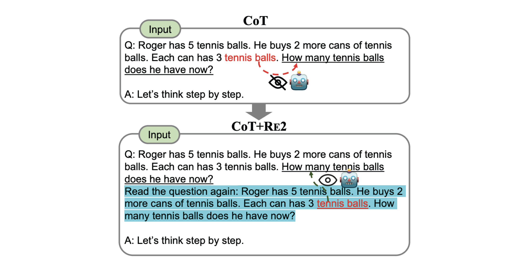

## Re-reading (RE2)
Re-reading (RE2) is a simple yet effective prompting technique that involves asking the language model to read the question twice before providing an answer. This approach aims to enhance the model's understanding of the question and improve its reasoning capabilities.

### How to use it
To use re-reading simply provide the user question to the model twice, with an instruction for the model to reread the question.

[See "Prompting" section for usage details](#prompting).

### When to use it
!!! tip "When to use re-reading"
    - Subtle questions where important information or context might easily be overlooked.
    - Situations where the model needs to focus more on key details provided in the question.
    - Complex reasoning tasks that require careful consideration of all the given information.

### What to know
RE2 allows the language model to process the question more thoroughly by reading it twice. This can lead to a better alignment between the question and the generated answer, as the model has an additional opportunity to grasp the question's nuances and context.

Implementing RE2 is straightforward and can be easily integrated into existing prompting methods. The technique simply involves repeating the question within the prompt, usually accompanied by an instruction to read it again.

RE2 is believed to work by allowing the language model to attend to tokens from the first pass during the second pass of the question. This effectively transforms the unidirectional attention of most modern language models into bidirectional attention. The first reading pass provides global context, which the model can leverage during the second reading pass to refine its comprehension.



### Best practices
!!! tip "Best practices for re-reading"
    - Provide a clear instruction for the model to re-read the question, such as "Read the question again:".
    - Repeat the question only once, as further repetition does not improve comprehension.
    - Position the repeated question immediately before the answer generation instruction for maximum impact.
    - Test different variations of the re-reading instruction to identify the most effective one for your specific use case.
    - Integrate RE2 with other prompting techniques, like chain-of-thought reasoning, to further enhance performance.

### What to watch out for
!!! warning "What to watch out for with re-reading"
    - Using RE2 increases the input length, which could impact processing time, memory usage, and cost, particularly for very lengthy questions.
    - RE2 may not provide significant benefits for extremely simple questions where re-reading does not offer additional insights or with the most advanced language models.

### Citations
Xu, X., Tao, C., Shen, T., Xu, C., Xu, H., Long, G., & Lou, J. (2023). Re-Reading Improves Reasoning in Large Language Models. [arXiv preprint arXiv:2309.06275](https://arxiv.org/abs/2309.06275).

### Prompting
### Prompt template
The RE2 prompt template is straightforward and works by repeating a specific instruction or question twice in a row. It includes a prompt to "Read the question again" before the repeated instruction or question.
> RE2 Prompting <br>
> Question: {Input query} <br>
> Read the question again: {Input query}

### Prompt example
User prompt:
> Question: Josh decides to try flipping a house. He buys a house for $80,000 and then puts in $50,000 in repairs. This increases the value of the house by 150%. How much profit does he make?
>
> Read the question again: Josh decides to try flipping a house. He buys a house for $80,000 and then puts in $50,000 in repairs. This increases the value of the house by 150%. How much profit does he make?

Model response (Llama 8B):
> Let's break it down step by step:
>
> 1. Josh buys the house for $80,000.
> 2. He spends $50,000 on repairs, so his total investment is $80,000 + >$50,000 = $130,000.
> 3. The repairs increase the value of the house by 150%. To find the new value, multiply the original value ($80,000) by 250% (which is equivalent to 1 + 0.5 or 1 + 150/100):
>
> $80,000 x 2.5 = $200,000
>
> 4. Since Josh's total investment was $130,000, his profit would be the difference between the new value and his investment:
>
> Profit = New Value - Total Investment = $200,000 - $130,000 = $70,000
>
> So, Josh makes a profit of $70,000 by flipping the house.

### API example
```python
import ollama

def re_reading_prompt(question):
  prompt = f"""
  Question: {question}
  Read the question again: {question}
  """
  
  model = 'phi3:mini'
  messages = [
      {
          'role': 'user',
          'content': prompt
      }
  ]

  # Make the request to the Ollama API
    response = ollama.chat(model=model, messages=messages, stream=False)
    return response["message"]["content"]

question = "A train travels at an average speed of 60 mph for the first half of its journey. For the second half of the journey, the train encounters some delays and its average speed drops to 40 mph. If the total journey is 200 miles, how long does the train take to complete the entire trip?"

answer = re_reading_prompt(question)
print(answer)
```