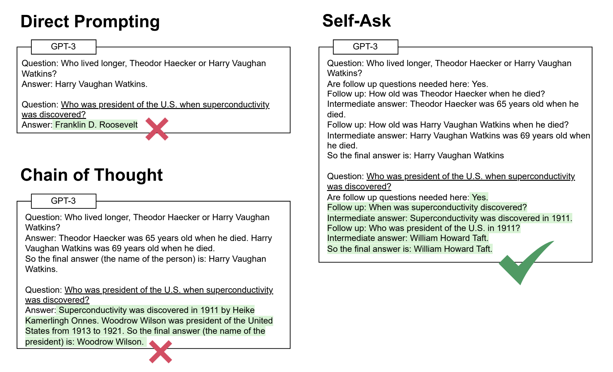

## Self-ask
Self-ask prompting is a technique where a language model explicitly asks itself follow-up questions to decompose a complex question before providing a final answer. This approach aims to improve the model's ability to perform multi-step reasoning and compose knowledge to answer challenging questions.

### How to use it
To use self-ask, provide an example of self-reflection along to the language model along with the question of interest.

[See "Prompting" section for usage details](#prompting).

### When to use it
!!! tip "When to use self-ask prompting"
    - For short, factual questions that require two or three steps (hops) of reasoning to arrive at the answer (see examples below).
    - Domains that involve complex queries with multiple dependencies or constraints, such as solving math word problems or explaining scientific concepts.
    - When interpretable, step-by-step reasoning is desired.
    - In agent frameworks where agents can gather information for sub-questions using external sources like the internet or a retrieval-augmented generation (RAG) approach.

### What to know
The self-ask prompting framework involves the following steps:

1. The language model is given a complex, multi-hop question along with a prompt that demonstrates how to break it down into simpler sub-questions.
2. The model generates sub-questions to gather the necessary information to answer the original question.
3. The model provides intermediate answers to each sub-question.
4. Finally, the model combines the intermediate answers to provide a final answer to the original question.

Self-ask prompting allows the language model to apply more computation to challenging multi-hop questions by breaking them down into discrete reasoning steps. This makes the model's reasoning process more interpretable compared to an unstructured chain-of-thought approach. A one-hop question can be answered using a single fact, like "What is the largest e-commerce company in the world?" (answer: Amazon). In contrast, a two-hop question requires combining two pieces of information, such as "Who is the founder of the largest e-commerce company in the world?" This requires knowing that:

1. Amazon is the largest e-commerce company in the world (first hop)
2. Jeff Bezos is the founder of Amazon (second hop)

An example of the self-ask technique is shown below. Text with a white background is the prompt, text with a green background is the LM output, and underlined text is the inference-time question.



### Best practices
!!! tip "Best practices for self-ask prompting"
    - Use consistent scaffolding like "Follow up:" and "Intermediate answer:" to give structure to the model's reasoning process.
    - Create a specific prompt template that can be reused for your specific use case.
    - Experiment with different prompt variations and sub-question granularity to optimize performance on a given task.
    - Consider combining self-ask prompting with an external knowledge source like a search engine or a RAG database to answer sub-questions.
    - Create reusable self-ask templates for frequently used self-ask prompts to save time, especially if the self-ask model is used for longer questions as creating one-off templates can be time consuming.


### What to watch out for
!!! warning "What to watch out for with self-ask prompting"
    - Crafting detailed self-ask prompts can be time-consuming.
    - The quality of the sub-questions generated by the model is important. Poorly formulated sub-questions can lead the model astray.
    - In a production application additional parsing logic is needed to separate and extract the final answer from the model's dialogue of intermediate questions and answers. 
    - There is a tradeoff between the granularity of sub-questions and computation, latency, and cost. Too many sub-questions can be inefficient.
    - The model may still hallucinate or introduce errors in the sub-question answering steps, so the overall answer is not guaranteed to be correct.
    - Self-asking tends to be most effective for small and mid-sized models and may be less impactful for the most advanced model versions. (In my testing, GPT-4 did not have trouble answering two-hop questions directly).


### Citations
Press, O., Zhang, M., Min, S., Schmidt, L., Smith, N. A., & Lewis, M. (2022). Measuring and Narrowing the Compositionality Gap in Language Models. [arXiv preprint arXiv:2210.03350](https://arxiv.org/abs/2210.03350).

### Prompting
#### Prompt template
The self-ask prompt template starts by presenting the model with a specific self-ask example dialogue and then proposing the question needing to be answered. The phrase "Are follow up questions needed here" is added to the end of the question to encourage the language model to use the self-ask methodology to answer the question.

> {self-ask example} <br>
> Question: {question} <br>
> Are follow up questions needed here:

### Prompt example
Example of a simple self-ask prompt framework. We first create an example of self-ask.
> Question: Who is the CEO of the company that created the iPhone?
> 
> Are follow up questions needed here: Yes.
> 
> Follow up: What company created the iPhone? <br>
> Intermediate answer: Apple created the iPhone.
> 
> Follow up: Who is the CEO of Apple? <br>
> Intermediate answer: Tim Cook is the CEO of Apple.
> 
> So the final answer is: Tim Cook is the CEO of the company that created the iPhone, Apple.

We then ask the model our question, including the above self-ask example:
> Question: Who was president of the U.S. when superconductivity
was discovered? <br>
> Are follow up questions needed here:

Model response (Llama 8B):
> Follow-up question: What year was superconductivity discovered?
>
> Intermediate answer: Superconductivity was first discovered in 1911 by Heike Kamerlingh Onnes.
>
> Follow-up question: Who was the president of the U.S. in 1911?
>
> Intermediate answer: President William Howard Taft was the president of the United States in 1911.
>
> So, the final answer is: William Howard Taft was the president of the U.S. when superconductivity was discovered in 1911.

### API exmaple
```python
from openai import OpenAI

# Set your API key
client = OpenAI(
    # This is the default and can be omitted
    api_key=os.environ.get("OPENAI_API_KEY"),
)

prompt_template = """
Question: Who is the CEO of the company that created the iPhone?

Are follow up questions needed here: Yes.

Follow up: What company created the iPhone? <br>
Intermediate answer: Apple created the iPhone.

Follow up: Who is the CEO of Apple? <br>
Intermediate answer: Tim Cook is the CEO of Apple.

So the final answer is: Tim Cook is the CEO of the company that created the iPhone, Apple.

Question: {question}

Are follow up questions needed here:
"""

question = "Who is the CEO of the company that created the iPhone?"

prompt = prompt_template.format(question=question)

completion = client.chat.completions.create(
    model="gpt-3.5",
    messages=[{"role": "user", "content": prompt}]
)

print(completion.choices[0].message.content)
```