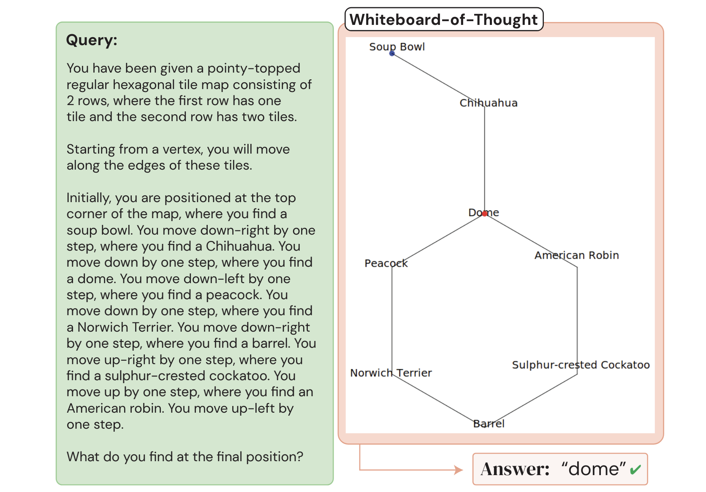
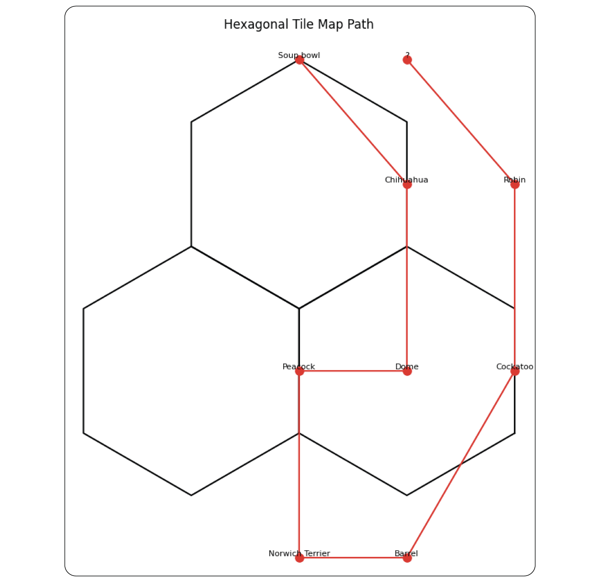
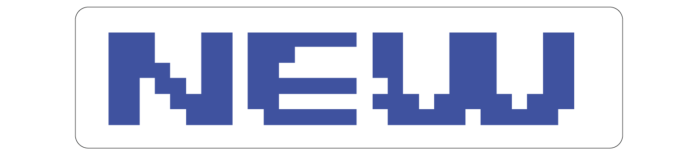

## Overview
Whiteboard-of-Thought (WoT) is a technique that leverages the visual reasoning capabilities of multimodal large language models (MLLMs) by allowing them to create and process visual aids during the reasoning process. This method is particularly useful for tasks that humans typically solve using visual thinking, such as spatial reasoning, diagram interpretation, and problem-solving that benefits from visual representation.

WoT was proposed in June of 2024 by Sachit Menon, Richard Zemel, and Carl Vondrick in the paper, "[Whiteboard-of-Thought: Thinking Step-by-Step Across Modalities](https://arxiv.org/abs/2406.14562)."

## How to use it
Whiteboard-of-Thought (WoT) involves two main interactions with a multimodal large language model (MLLM):

### Interaction 1: Visualization Creation

- Provide the MLLM with the original query.
- Instruct the model to create visualizations using a specific Python library (e.g., Matplotlib or Turtle).
- The model generates Python code to create the visual.

After this interaction, execute the generated code to produce an image (this may require manual intervention or a secure code execution environment).

### Interaction 2: Visual Interpretation

- Feed the resulting image back to the MLLM.
- Instruct the model to analyze the image in the context of the original query.
- Request a final answer or further reasoning based on the visual.
- The model produces the final result.

See ["Prompting"](#prompting) and ["Code example"](#code-example) sections for usage details.

## When to use it
!!! tip "When to use Whiteboard-of-Thought"
    - Ideal for tasks that involve visual or spatial reasoning, such as understanding ASCII art, solving geometric problems, or navigating spatial structures.
    - Effective in situations where creating a visual representation can simplify complex information or relationships.
    - Particularly useful for queries that humans would typically solve by drawing diagrams or sketches.

## What to know
WoT aims to empower MLLMs to create and reason with explicit visuals, similar to how humans might use a whiteboard to solve problems. By generating code to create visualizations and then processing these visuals, MLLMs can mimic basic visual thinking. This process involves two model interactions (See ["How to use it"](#how-to-use-it) or ["Prompting"](#prompting) section for details):

1. Visualization Creation: The MLLM generates code to create a visual representation of the problem.
2. Visual Interpretation: The MLLM analyzes the generated image to produce a final answer or further reasoning.

In Figure 5 of their paper, the authors demonstrate their approach by passing in a spatial-reasoning prompt to GPT-4o (left green box below). While the model is unable to solve the problem via text reasoning alone, after being prompted to code the solution the model successfully found the correct answer, "Dome" (right diagram below).



However, it's important to note that results can vary depending on the model used and the stochastic nature of model output. In my attempt to reproduce Figure 5 using Claude Sonnet 3.5 on June 30, 2024, the model created a nonsensical diagram and failed to arrive at a clear answer:


## Small-scale replication
The authors also tested several tasks from the BIG-Bench evaluation dataset, including deciphering words written in ASCII art. I also did a small-scale replication of this task using Claude Sonnet 3.5 by selecting random samples from the ASCII Word Recognition task (see [code example](#code-example) below plus additional details in this [Python notebook](https://github.com/jjmacky/lm-toolkit/blob/main/code/prompt_dictionary/zero_shot/whiteboard_of_thought/whiteboard_of_thought.ipynb) and the [parent project folder](https://github.com/jjmacky/lm-toolkit/tree/main/code/prompt_dictionary/zero_shot/whiteboard_of_thought)). The improvement in model performance for this task was obvious. For example, when provided the word "NEW" as an ASCII art text string the model incorrectly identified the word as "REVIEW."

```
d8b...db.d88888b.db...d8b...db.
888o..88.88'.....88...I8I...88.
88V8o.88.88ooooo.88...I8I...88.
88.V8o88.88~~~~~.Y8...I8I...88.
88..V888.88......`8b.d8'8b.d8'.
VP...V8P.Y88888P..`8b8'.`8d8'..
...............................
...............................
```

However, when given the chance to code a solution to the problem the model produced Python code which transformed the image into this much more legible version, which it was then able to correctly identify.


I further programmatically analyzed the paper's findings on ASCII word art (see ["Code example"](#code-example) section below for implementation).

In my small-scale replication using 10 random samples (compared to the authors' 250) and Claude Sonnet 3.5 (instead of GPT-4o), the results were generally in line with the authors' findings, albeit with some differences:

- Standard zero-shot performance: 20-30% accuracy (authors reported 25%)
- WoT performance: 50% accuracy (authors reported 66%)

For this simple replication I did not distinguish between the five types of ASCII art words tested by the authors and instead report the top-line results. However, the set of 10 random words that were selected have coverage across four of the five word types (no "Bubble" words were randomly selected).

From my observations, the primary reason for not achieving 100% accuracy with WoT was the model's inability to generate code that produced coherent images. However, when the model _did_ successfully produce code that converted the ASCII word art into images, the results were typically easy to read and the model interpreted them correctly (e.g., see the conversion of the word "NEW" above).

Further details can be found in the [original paper](https://arxiv.org/abs/2406.14562).

## Best practices
!!! tip "Best practices for Whiteboard-of-Thought"
    - See [code example](#code-example) below for a starter template and approach.
    - Provide clear, detailed instructions for both code generation and image interpretation steps.
    - Specify the desired visualization library (e.g., Matplotlib, Turtle) and any constraints or specifications for the visualization.
    - Request model predictions in a structured format (e.g., JSON) for easier processing and evaluation.
    - Consider multiple iterations of visualization and interpretation if initial results are unclear.
    - Implement error handling and validation to manage potential issues with code generation or execution.
    - Ensure that the visualization step doesn't introduce errors or biases not present in the original query.

## What to watch out for
!!! warning "What to watch out for with Whiteboard-of-Thought"
    - WoT requires a multimodal model with vision, coding, and language capabilities, which may limit its applicability with some models.
    - Vision capabilities in models may increase costs; check your model's token pricing for vision inputs.
    - While WoT demonstrates multimodal model flexibility, finding practical use cases may be challenging in some domains.
    - The technique requires either manual intervention to run the returned code or advanced, secure coding environments that can safely process third-party code.
    - Code generation quality can vary, potentially resulting in errors or unusable visualizations.
    - WoT may not work consistently across different scenarios or models (see spatial reasoning replication attempt above).
    - The approach may be computationally intensive and time-consuming, especially for complex tasks or when used at scale.
    
## Citations
Menon, S., Zemel, R., & Vondrick, C. (2024). Whiteboard-of-Thought: Thinking Step-by-Step Across Modalities. arXiv preprint [arXiv:2406.14562](https://arxiv.org/abs/2406.14562).

The authors also have [a project page for WoT](https://whiteboard.cs.columbia.edu/).

## Prompting
The WoT prompt template instructs the model to create visualizations using Python libraries and then interpret these visuals to answer the query. The template consists of two main parts:

1. Instructions for visualization creation:
    - Specify the Python library to use (e.g., Matplotlib, Turtle)
    - Provide any necessary constraints or specifications for the visualization

2. Instructions for visual interpretation:
    - Ask the model to analyze the generated image
    - Request a final answer or further reasoning based on the visual

### Prompt template
#### Prompt 1:
> You write code to create visualizations using the {Matplotlib/Turtle} library in Python, which the user will run and provide as images. Do NOT produce a final answer to the query until considering the visualization. <br>
> Query: {original query} <br>

#### Prompt 2:
> {Image from query 1} <br>
> {Additional instructions as needed (e.g., "Identify the word in the image.")} <br>

### Code example
This code demonstrates the implementation of both standard zero-shot prompting and the WoT approach, allowing for a direct comparison of their performance on ASCII art word recognition tasks.

The code below represents my own small-scale replication of the results in Menon et al. Specifically, the middle column of Table 1, deciphering words in the BIG-Bench ASCII word art task. For more code as well as the full set of files used in this small replication see this [Python notebook](https://github.com/jjmacky/lm-toolkit/blob/main/code/prompt_dictionary/zero_shot/whiteboard_of_thought/whiteboard_of_thought.ipynb) and the [parent project folder](https://github.com/jjmacky/lm-toolkit/tree/main/code/prompt_dictionary/zero_shot/whiteboard_of_thought).

The replication process follows these steps:

- Step 0. Read in BIG-bench JSON.
- Step 1. Select 10 random ASCII art words.
- Step 2. Send ASCII art words to the model using a standard zero-shot prompt to establish a performance baseline.
- Step 3. Send ASCII art words to the model using WoT to request visualization code.
- Step 4. Manually run the generated code to create images.
- Step 5. Send the resulting images to the vision API and calculate the performance improvement.

#### Prepare data
##### Step 0. Read in BIG-bench JSON.
Standard zero-shot prompting resulted in an accuracy of between 20% and 30% (I sent the same 10 words to the model multiple times).
```python
import json

# Read in the BIG-bench JSON file.
file_name = "whiteboard_of_thought_bigbench_task.json"
with open(file_name, "r") as f:
    ascii_words = json.load(f)
```

We need to access the "examples" array from the `ascii_words` object.

#### Evaluate standard zero-shot performance
##### Step 1. Select 10 random ASCII art words.
##### Step 2. Send ASCII art words to the model using a standard zero-shot prompt to establish a performance baseline.

```python
import anthropic
import random
import json

client = anthropic.Anthropic() # Defaults to os.environ.get("ANTHROPIC_API_KEY")

# Function to build the complete prompt.
def build_prompt(prompt_array):
    return "\n\n".join(prompt_array)

# Function to call Claude Sonnet 3.5 and return the api response
def call_model(prompt):
    message = client.messages.create(
        model="claude-3-5-sonnet-20240620",
        max_tokens=1024,
        messages=[
            {"role": "user", "content": prompt}
        ]
    )
    return message.content[0].text

# Parse the string response into JSON and return the identified word.
def parse_api_response_to_json(api_response):
    # For robustness: Find the starting and ending positions of the JSON part and extract the json object from the response (may not be necessary if model is well behaved).
    start_index = api_response .find('{')
    end_index = api_response.find('}') + 1
    word_json = api_response[start_index:end_index]

    # Add additional failure logic just in case.
    try:
        return json.loads(word_json)["word"].lower() # Convert to json object
    except Exception as e:
        print("Could not parase JSON. API response was: {api_response}. {Error: {e}")
        return "NA"

# Function to print the target word, what Claude Sonnet 3.5 thinks the word is, and whether they are the same.
def pretty_print_results(index, identified_word, target_word):
    print(f"Here are the results for ASCII image {index} in the random sample.")
    print(f"Claude Sonnet 3.5 thinks the word is: {identified_word}")
    print(f"The actual word is: {target_word}")     
    print(f"Is Claude sonnet 3.5 correct? {identified_word == target_word}") # Is Claude Sonnet 3.5 correct?
    print("-----------\n")

# Function to print and return the proportion of correct ASCII image words that Claude Sonnet 3.5 got correct.
def calculate_percentage_correct(results):
    num_correct = sum(1 for item in results.values() if item['target_word'] == item['identified_word']) # Trick to count number correct
    proportion_correct = (num_correct / len(results)) # Calculate proportion correct
    print(f"\n\nClaude got {proportion_correct:.2%} correct.") # Print in % format, adding two decimal places to future proof for larger tests
    return proportion_correct * 100 # Convert to percentage

###
# Start of loop logic
###

#Include an instruction for JSON for easier post-processing.
JSON_INSTRUCTIONS = """ 
Return only the word in JSON format.
For example, if you believe the word is "anthropic" you would return this:

{"word": "anthropic"}
"""

random.seed(11) # Set seed for reproducibility
num_ascii_samples = 10 # Just a small scale replication
random_ascii_images = random.sample(ascii_words["examples"], num_ascii_samples)
standard_zero_shot_results = {} # Save results for later processing

# Utilize the functions we wrote above.
for index, ascii_image in enumerate(random_ascii_images, start=1):
    ascii_art_prompt = ascii_image["input"]
    target_word = ascii_image["target"]
    prompt = build_prompt([ascii_art_prompt, JSON_INSTRUCTIONS])
    api_response = call_model(prompt)
    identified_word = parse_api_response_to_json(api_response)
    standard_zero_shot_results[index] = {}
    standard_zero_shot_results[index]["target_word"] = target_word
    standard_zero_shot_results[index]["identified_word"] = identified_word
    pretty_print_results(index, identified_word, target_word)

calculate_percentage_correct(standard_zero_shot_results)
```

#### Evaluate performance using WoT
##### Step 3. Send ASCII art words to the model using WoT to request visualization code.
```python
import re

client = anthropic.Anthropic() # Defaults to os.environ.get("ANTHROPIC_API_KEY")

# Define a function to extract the code block from the model response
def extract_code_block_from_text(text):
    return re.search(r"```python(.*?)```", text, re.DOTALL).group(1)

# Define a function to strip out just the ASCII art from the BIG-Bench task
def extract_ascii_image(full_text):
    return full_text.replace("What word is displayed in the ASCII art below?", "")

# Define a function to print the code block for manual execution
def print_code_block(code_block):
    print(code_block)

# Start of loop logic
WOT_PROMPT = """Write Python code with Matplotlib to render the ASCII art as an image. Let the main figure be called fig with size 6,6.
Ensure each character in the input is considered. Remember colors are matplotlib.colors, and colors must be RGB to be displayed. Remember not all rows are necessarily the same length."""

for index, ascii_image in enumerate(random_ascii_images, start=1): # Use same random images from standard zero-shot example
    ascii_art_prompt = ascii_image["input"]
    ascii_image_text = extract_ascii_image(ascii_art_prompt)
    prompt = build_prompt([WOT_PROMPT, ascii_image_text])
    api_response = call_model(prompt)
    model_generated_code = extract_code_block_from_text(api_response)
    print_code_block(model_generated_code) # I'll manually copy and paste and run the code for this small-scale example
    print("\n\n -------------")
```

##### Step 4. Manually run the generated code to create images.
Manually execute each code block returned and save the resulting image the images folder (not shown). See [Python notebook](https://github.com/jjmacky/lm-toolkit/blob/main/code/prompt_dictionary/zero_shot/whiteboard_of_thought/whiteboard_of_thought.ipynb) for full code.

##### Step 5. Send the resulting images to the vision API and calculate the performance improvement.
For the 10 random words I selected this resulted in an accuracy of 50%. About double the performance of standard zero-shot prompting.

```python
import base64
import os

# Read the image file and encode it to base64
def generate_image_data(image_path):
    with open(image_path, "rb") as image_file:
        return base64.b64encode(image_file.read()).decode("utf-8")


def call_vision_model(image_data, prompt):
    message = client.messages.create(
        model="claude-3-5-sonnet-20240620",
        max_tokens=1024,
        messages=[
            {
                "role": "user",
                "content": [
                    {
                        "type": "image",
                        "source": {
                            "type": "base64",
                            "media_type": "image/jpeg",
                            "data": image_data,
                        },
                    },
                    {
                        "type": "text",
                        "text": prompt
                    }
                ],
            }
        ],
    )
    return message.content[0].text

# Read in saved images from the previous step
image_folder = 'images'
image_files = [os.path.join(image_folder, f) for f in os.listdir(image_folder) if f.endswith('.jpg')]
image_files.sort(key=lambda x: int(os.path.splitext(os.path.basename(x))[0].split('_')[1])) # Sort the files numerically


wot_results = {}
prompt = build_prompt(["What word does this image depict?", JSON_INSTRUCTIONS]) # This prompt is the same for all images

# Reuse functions and design pattern from previous steps
for index, image_path in enumerate(image_files, start=1):
    target_word = random_ascii_images[index-1]["target"]
    image_data = generate_image_data(image_path)
    api_response = call_vision_model(image_data, prompt)
    identified_word = parse_api_response_to_json(api_response)
    wot_results[index] = {}
    wot_results[index]["target_word"] = target_word
    wot_results[index]["identified_word"] = identified_word
    pretty_print_results(index, identified_word, target_word)

calculate_percentage_correct(wot_results)
```