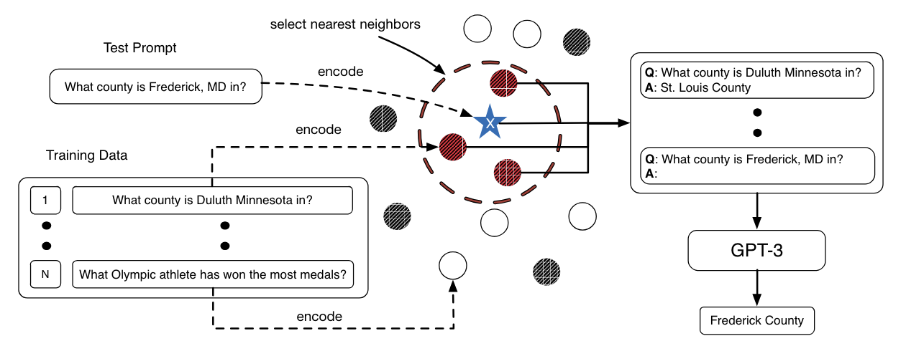

## KATE (kNN-Augmented in-conText Example selection)
KATE is a technique [introduced in early 2021](#citation) that aims to improve the few-shot learning capabilities of large language models, at the time demonstrated with GPT-3, by selecting semantically similar in-context examples at inference for a given user input.

KATE can be considered an early, specialized form of Retrieval-Augmented Generation (RAG), but it differs from more recent RAG techniques in its focus and application. While KATE aims to improve task performance through retrieval of similar examples, modern RAG techniques are more focused on increasing factual accuracy, reducing hallucinations, and integrating enterprise knowledge bases into standard language model workflows.

KATE is most effective when the retrieved examples significantly enhance the model's ability to generate appropriate responses. It's less suitable for tasks requiring factual accuracy (where newer RAG methods might be better) or those where simpler techniques (like standard kNN or basic prompting) are sufficient.

### How to use it
Implementing KATE requires a more advanced application approach than simple prompting methods. It involves two main steps, preprocessing a dataset of examples, and comparing those examples to user input during inference. 

1. Preprocessing (done once):
    1. Choose a pre-trained sentence encoder (e.g., RoBERTa-large)
    2. Encode all examples in a relevant dataset using this encoder (for example the SST-2 dataset if the application task is sentiment analysis)
    3. Store these encodings for efficient retrieval
2. Model inference
    1. For each user request:
        1. Encode the main question or instruction to be asked of the langauge model using the same sentence encoder
        2. Calculate the distance between the encoded question/instruction and each entry in the embedded example set from the preprocessing step
        2. Retrieve the k nearest neighbors from the embedded example set relative to the question/instruction
        3. Use these retrieved examples as the in-context examples for the language model
    2. Prompt construction:
        1. Format the retrieved examples and the question/instruction into a prompt
        2. The prompt format typically follows: [Retrieved examples] + [question/instruction]
    3. Model API call:
        1. Send the constructed prompt to the language model
        2. The model generates its response based on this augmented context
    4. Post-processing:
        1. Process the model's output as needed for your specific application


### When to use it
!!! tip "When to use KATE"
    **Consider using KATE when the following conditions hold:**

    1. Model characteristics:
        - You're working with a language model that benefits significantly from in-context examples.
        - In many applications the model is likely to be relatively small or medium-sized, as larger models might not see substantial improvements.

    2. Data requirements:
        - You have access to a relevant, high-quality dataset of examples (typically thousands to tens of thousands) for embedding.
        - Your dataset is not primarily factual (for factual retrieval, newer RAG methods are often more appropriate).

    3. Task constraints:
        - The task requires adherence to specific rules or patterns, and examples can effectively demonstrate these rules, serving as a flexible alternative to writing explicit, complex operational logic. See [Application example](#application-example-pii-masking-with-llama3-8b) below for an implementation of this scenario.
        - Fine-tuning is not feasible or desirable (e.g., to avoid overfitting on small datasets).
        - You need more nuanced outputs than standard kNN classification can provide.

    4. Computational resources:
        - You have sufficient GPU power to compute embeddings and distances without introducing significant latency during preprocessing or inference.
        - Your embedded dataset is small enough (typically <100,000 examples) to allow for quick nearest neighbor searches.

    5. Application focus:
        - You're working on tasks that benefit from dynamic, context-sensitive responses rather than static, pre-defined answers.

    **Potential Applications:**
    
    1. Text PII masking:
        - Example scenario: Masking PII data in unstructured text using a pre-defined set of tags.
        - Why KATE: Can use similar masked PII text to infer proper masking tags without building complex business logic into this system.
        - See [Application example](#application-example-pii-masking-with-llama3-8b) below for an implementation of this scenario.
    
    1. Nuanced sentiment analysis:
        - Example scenario: Analyzing customer feedback in a niche industry with unique terminology and sentiment expressions.
        - Why KATE: Can provide relevant industry-specific examples to guide the model's interpretation, potentially outperforming generic sentiment classifiers.

    2. Conceptual tutoring systems:
        - Example scenario: Creating an AI tutor for advanced physics concepts.
        - Why KATE: Can retrieve and present relevant problem-solution pairs to help explain complex concepts, potentially offering more tailored explanations than a static knowledge base.

    4. Rapid prototyping in new domains:
        - Example scenario: Quickly developing a proof-of-concept for analyzing literary styles across different authors.
        - Why KATE: Allows for fast implementation using a small, curated dataset of literary examples, potentially demonstrating the feasibility of AI-assisted literary analysis without extensive model training.

### What to know
KATE was originally developed and tested on GPT-3, demonstrating its effectiveness in enhancing the model's few-shot learning capabilities across various natural language understanding and generation tasks. The method is a form of Retrieval-Augmented Generation (RAG) applied specifically to in-context example selection, which allowed GPT-3 to leverage relevant information from a large corpus of examples without fine-tuning.

The authors presented the image below contrasting KATE, which uses k-nearest neighbors search during inference to find relevant examples, with a less tailored approach that uses random examples.



The paper's experiments showed that KATE consistently outperformed random example selection across different tasks, including sentiment analysis, table-to-text generation, and open-domain question answering. Particularly notable were the improvements on complex tasks like table-to-text generation (41.9% improvement on the ToTTo dataset) and open-domain question answering (45.5% improvement on the Natural Questions dataset).

An important finding was that the choice of sentence encoder for retrieving similar examples significantly impacts KATE's performance. The researchers found that encoders fine-tuned on task-related datasets often yielded better results. This suggests that tailoring the retrieval mechanism to the specific task can further enhance the method's effectiveness.

While KATE showed promise in 2021, it's important to note that the field of natural language processing is rapidly evolving. More advanced RAG methods and few-shot learning techniques have been developed since KATE was introduced, potentially offering better performance or efficiency for certain applications. Additionally, as language models continue to grow in size and capability, the relative benefits of techniques like KATE may change. Therefore, it's crucial to benchmark KATE against current state-of-the-art methods when considering its use in practical applications.

### Best practices
!!! tip "Best practices for using KATE"
    - Use a pre-trained sentence encoder like RoBERTa for initial implementation.
    - If there is a sentence encoder that has been fine-tuned on a similar task or dataset, use that as it can improve performance. Experiment with fine-tuning the encoder on task-specific datasets.
    - Use the largest dataset you can for a fixed inference latency threshold (increasing the search space of relevant examples improves performance by helping to select more relevant in-context examples).
    - Using around 5 in-context examples is a good rule of thumb to balance performance and inference cost/latency (k=5).
    - When constructing the in-context examples for the prompt, the order of the examples likely doesn't matter. Try experimenting with both the default (closest examples first) and reversed (closest examples nearst the question/instruction) orders.

### What to watch out for
!!! warning "What to watch out for with KATE"
    - As models and retrieval methods continue to advance KATE may have more limited use cases, try standard prompting methods before implementing KATE.
    - KATE requires significant additional infrastructure compared to standard prompting (including an embedded dataset and additional computational resources for inference).
    - Performance gains may vary across different models and tasks.
    - The choice of sentence encoder can significantly impact results, use an encoder fine-tuned on a similar task or dataset if possible.
    - More recent developments in RAG and few-shot learning techniques may offer better performance or efficiency, especially when factual information is the priority.

### Citation
Liu, J., Shen, D., Zhang, Y., Dolan, B., Carin, L., and Chen, W. 2021. What Makes Good In-Context Examples for GPT-3. [arXiv preprint arXiv:2101.06804](https://arxiv.org/abs/2101.06804). DOI: 10.48550/arXiv.2101.06804.

### Application example - PII masking with Llama3 (8B)
Let's implement KATE in a realistic setting. We'll consider the task of masking personally identifiable information (PII) without fine-tuning a model. At inference, given a sentence to mask, we'll use KATE to look up relevant examples to guide the model on which masks to use. 

For this example, we're using the pii-masking-300k dataset, which can be found [here](https://huggingface.co/datasets/ai4privacy/pii-masking-300k?row=0). This synthetic dataset contains various text entries including personal statements, forms and ID cards, government records, and other types of text likely to contain PII. To follow the format of pii-masking-300k, we must use a predefined set of masking tags (i.e. we cannot simply delete the data or replace it with 'xxxxxxxx'), which makes the task a good candidate for KATE.

The Python notebook for the code below can be found [here](https://github.com/jjmacky/prompt_dictionary/blob/main/docs/prompting/few_shot/kate_demo.ipynb).

#### Methodology
Our approach follows the KATE methodology:

1. Embed the training dataset from pii-masking-300k (about 178,000 total pairs of masked and unmasked sentences).
2. To simulate inference, select a random sentence from the pii-masking-300k validation dataset.
3. Embed this sentence and calculate its k nearest neighbors in the embedded training dataset.
4. Build a prompt with the resulting examples and the random sentence to be masked.
5. Serve this prompt to the model (Llama3 8B in this case).

#### Results
Before diving into the code, let's examine the results to motivate the implementation.
This was the random entry from the validation set used to simulate KATE inference:
```yaml
Immunization Certification:
  individuals:
    - Princess
    - hlfiadjwhwi16966
    - +22-252 178-7818
    - United Kingdom
    - 636
    - Fleming Way
    - Swindon
    - ENG
    - SN1 2NN
    - Townhouse 90
    - 05:59
    - Morag
  background:
    - 23/09/1972
```

Here is the ground truth masked entry from the dataset:
```yaml
- Immunization_Certification:
    individuals:
      - [TITLE]
      - [USERNAME]
      - [TEL]
      - [COUNTRY]
      - [BUILDING]
      - [STREET]
      - [CITY]
      - [STATE]
      - [POSTCODE]
      - [SECADDRESS]
      - [TIME]
      - [LASTNAME1]
    background:
      - [DATE]
```

After providing Llama3 (8B) with the top 5 nearest neighbors as examples along with the random entry above, this is how the model masked PII:
```yaml
- Immunization_Certification:
  individuals:
    - [TITLE]
    - [BOD] # Wrong, should be [USERNAME]
    - [TEL]
    - [COUNTRY]
    - [BUILDING]
    - [STREET]
    - [CITY]
    - [STATE]
    - [POSTCODE]
    - [SECADDRESS]
    - [TIME]
    - [LASTNAME1]
  background:
    - [DATE]
```
The model got a single tag wrong, which is not perfect, but still pretty good compared to the other methods we'll see below. The strong performance is due to the fact that the k neighbors identified during inference are similar to the sample, allowing the model to infer the masked tags for the unseen sample. Here is the unmasked and masked nearest neighbor for the inference sample.

Unmasked:
```yaml
    - 8207886065
    - 974312500
    - +132 289 676-9075
    - United States
    - 332
    - Rochelle Street
    - New York
    - NY
    - 10464
    - Flat 298
    - ~`4teF
    - Langmeier
    - COMMENTS_C: "Conduct IP audit, update trademark portfolio, support patent applications process."
background:
    6:30 AM
    31st October 2027
```

Masked:
```yaml
    - [IDCARD]
    - [PASSPORT]
    - [TEL]
    - [COUNTRY]
    - [BUILDING]
    - [STREET]
    - [CITY]
    - [STATE]
    - [POSTCODE]
    - [SECADDRESS]
    - [PASS]
    - [LASTNAME1]
    - COMMENTS_C: "Conduct IP audit, update trademark portfolio, support patent applications process."
background:
    [TIME]
    [DATE]
```

Let's compare KATE with other methods. Below is the result if we just try asking Llama3 (8B) to mask the entry using the simple prompt:
> "Please mask the personally identifiable information in this text: {random entry}"

This is also a good check for data contamination. If the model had memorized the PII dataset, it might achieve strong zero-shot masking performance without much direction or examples. However, it does not. Every field returned by the model is incorrect.

```yaml
- Immunization_Certification:
  individuals:
    - Princess
    - XXXXXXXXXXXXXXXXXX
    - XXXXXXXX
    - United Kingdom
    - XXXX
    - Fleming Way
    - Swindon
    - ENG
    - SN1 2NN
    - Townhouse 90
    - 05:59
    - Morag
  background:
    - XXXX/09/1972
```

We can also test providing the model with the available set of masks and judge performance. Here the model does much better, but still gets many fields incorrect.
> "You have the following list of masks available: [BOD], [BUILDING], [CITY], [COUNTRY], [DATE], [DRIVERLICENSE], [EMAIL], [GEOCOORD], [GIVENNAME1], [GIVENNAME2], [IDCARD], [IP], [LASTNAME1], [LASTNAME2], [LASTNAME3], [PASS], [POSTCODE], [SECADDRESS], [SEX], [SOCIALNUMBER], [STATE], [STREET], [TEL], [TIME], [TITLE], [USERNAME].
>
> Please mask the personally identifiable information in this sentence using the appropriate mask: {random entry}"

```yaml
Immunization_Certification:
  individuals:
    - Princess # Wrong, should be [TITLE]
    - [SOCIALNUMBER] # Wrong, should be [USERNAME]
    - +[TEL] # Wrong (shouldn't include '+')
    - [COUNTRY]
    - [DATE] # Wrong, [DATE] is not present
    - [STREET] # Missing [BUILDING], [CITY], and [STATE]
    - [POSTCODE]
    - [SECADDRESS]
    - [TIME]
    - Morag # Wrong, should be [LASTNAME1]
  background:
    - [DATE]
```

We can also follow the approach of Liu et al. in their paper by selecting random examples rather than the k nearest. Here, again this results in a response with many incorrectly masked fields.
```yaml
- Immunization_Certification:
  individuals:
    - [NAME1] # Wrong, should be [TITLE]
    - [USERNAME]
    - [PHONE_NUMBER] # Wrong, should be [TEL]
    - [COUNTRY]
    - [NUMBER] # Wrong, should be [BUILDING]
    - [STREET_ADDRESS] # Wrong, should be [STREET]
    - [CITY]
    - [STATE]
    - [POSTAL_CODE] # Wrong, should be [POSTCODE]
    - [ADDRESS_LINE2] # Wrong, should be [SECADDRESS]
    - [TIME]
    - [NAME2] # Wrong, should be [LASTNAME1]
  background:
    - [DATE]
```

This comparison demonstrates that KATE's approach of selecting relevant examples based on similarity has the potential to outperform both zero-shot and random example selection methods for novel use cases not originally considered in the KATE paper. However, a more comprehensive evaluation across multiple examples would be necessary to draw broader conclusions about its overall effectiveness.

#### Code

##### Load dataset from Hugging Face
```python
from datasets import load_dataset
dataset = load_dataset("ai4privacy/pii-masking-300k")
```

##### Load custom functions
```python
import numpy as np
from sklearn.metrics.pairwise import cosine_similarity
from transformers import RobertaTokenizer, RobertaModel
from tqdm import tqdm
import torch
import ollama

# Initialize RoBERTa tokenizer and model
tokenizer = RobertaTokenizer.from_pretrained('roberta-base', output_attentions=False)
model = RobertaModel.from_pretrained('roberta-base', output_attentions=False, output_hidden_states=False)

# Function to generate embeddings for a given text using RoBERTa
def get_roberta_embedding(text):
    inputs = tokenizer(text, return_tensors="pt", padding=True, truncation=True, max_length=512)
    with torch.no_grad():
        outputs = model(**inputs)
    return outputs.last_hidden_state.mean(dim=1).squeeze().numpy()  # Average pooling of last hidden state

# Embed all entries in the dataset, showing progress with tqdm
def embed_data(data):
    for entry in tqdm(data, desc="Embedding entries"):
        embedding = get_roberta_embedding(entry["original"]) # Embed the original sentence to be masked for later comparison during inference
        entry["embedding"] = embedding
    return data

# Calculate similarity between a new text and the dataset, returning top k similar indices
def calculate_similarity(new_text_embedding, data, k=5):
    similarity_scores = cosine_similarity([new_text_embedding], [d["embedding"] for d in data])[0]
    top_k_indices = np.argpartition(similarity_scores, -k)[-k:] # Only do a partial sort the entire dataset for efficiency
    top_k_indices = top_k_indices[np.argsort(similarity_scores[top_k_indices])][::-1] # Quickly sort the top indices
    return top_k_indices

# Generate example masked sentences from the most similar entries
def get_example_masked_sentences(top_k_indices, data):
    example_masked_sentences = "\n\n".join(
        f"Original sentence:{data[index]['original']}\n\nMasked sentence:{data[index]['masked']}"
        for index in top_k_indices
    )
    return example_masked_sentences

# Build a prompt for the language model using examples and the sentence to mask
def build_model_prompt(example_masked_sentences, sentence_to_mask):
    template = """
        Please mask the PII in the given sentence by following the examples:

        {examples}

        Here is the sentence to mask. Respond only with the masked sentence and no additional explanation or commentary:
        Sentence to mask: {sentence}
        Masked sentence:
        """
    
    return template.format(
        examples=example_masked_sentences,
        sentence=sentence_to_mask
    )

# Call the language model to perform PII masking during inference
def call_model(prompt, llm_model):
    messages = [
        {"role": "user", "content": prompt}
    ]
    response = ollama.chat(model=llm_model, messages=messages, stream=False)
    result = response['message']['content']
    return result
```

##### Create and embed data
```python
from tqdm import tqdm
data = []
for index in tqdm(range(len(dataset['train'])), desc="Creating dataset:"):
    data.append({"original": dataset['train'][index]['source_text'], "masked":dataset['train'][index]['target_text']})

embedded_data = embed_data(data)
```

##### Perform simulated inference
```python
random.seed(14) # Set random seed

# Pick random sentence from validation set to use as a test of the approach
rand_index = np.random.choice(len(dataset['validation']), 1)
test_sentence = dataset['validation'][rand_index]['source_text']
target_sentence = dataset['validation'][rand_index]['target_text']

# Get similar sentence for our test sentence in our embedded data
embedded_test_sentence = get_roberta_embedding(test_sentence)
top_k_indices = calculate_similarity(embedded_test_sentence, embedded_data)

# Build the model prompt
example_masked_sentences = get_example_masked_sentences(top_k_indices, embedded_data)
prompt = build_model_prompt(example_masked_sentences, test_sentence)

# Get the masked sentence
masked_sentence = call_model(prompt, "llama3")

# Compare the masked sentence from our model with the ground truth from the data
print(f"Masked sentence from model: {masked_sentence}")
print(f"Masked ground-truth sentence from data: {target_sentence}")
```

##### Examine alternative inference approaches
First, we can just try asking the model to mask the sentence. This is also a good check to see if there is data contamination. If the model memorized the PII dataset it might achieve strong zero-shot masking without much direction.
```python
prompt = f"Please mask the personally identifiable information in this sentence: {test_sentence}"

messages = [
    {"role": "user", "content": prompt}
]
response = ollama.chat(model="llama3", messages=messages, stream=False)
result = response['message']['content']

print(result)
```

Alternatively we can be more sophisticated and give the model the list of masks available. This approach still produces many incorrect masks.
```python
masks = "[BOD], [BUILDING], [CITY], [COUNTRY], [DATE], [DRIVERLICENSE], [EMAIL], [GEOCOORD], [GIVENNAME1], [GIVENNAME2], [IDCARD], [IP], [LASTNAME1], [LASTNAME2], [LASTNAME3], [PASS], [POSTCODE], [SECADDRESS], [SEX], [SOCIALNUMBER], [STATE], [STREET], [TEL], [TIME], [TITLE], [USERNAME]"
prompt = f"You have the following list of masks available: {masks}.\n\n Please mask the personally identifiable information in this sentence using the appropriate mask: {test_sentence}"

messages = [
    {"role": "user", "content": prompt}
]
response = ollama.chat(model="llama3", messages=messages, stream=False)
result = response['message']['content']

print(result)
```

We can also test if KATE outperforms using random examples chosen from the dataset rather than the k nearest neighbors.
```python
k = 5
random_top_k_indices = np.random.choice(range(len(data)), k)
example_masked_sentences = get_example_masked_sentences(random_top_k_indices, data)
prompt = build_model_prompt(example_masked_sentences, test_sentence)
masked_sentence = call_model(prompt, "llama3")

# Compare the masked sentence from our model with the ground truth from the data
print(f"Masked sentence from model: {masked_sentence}")
print(f"Masked ground-truth sentence from data: {target_sentence}")
```