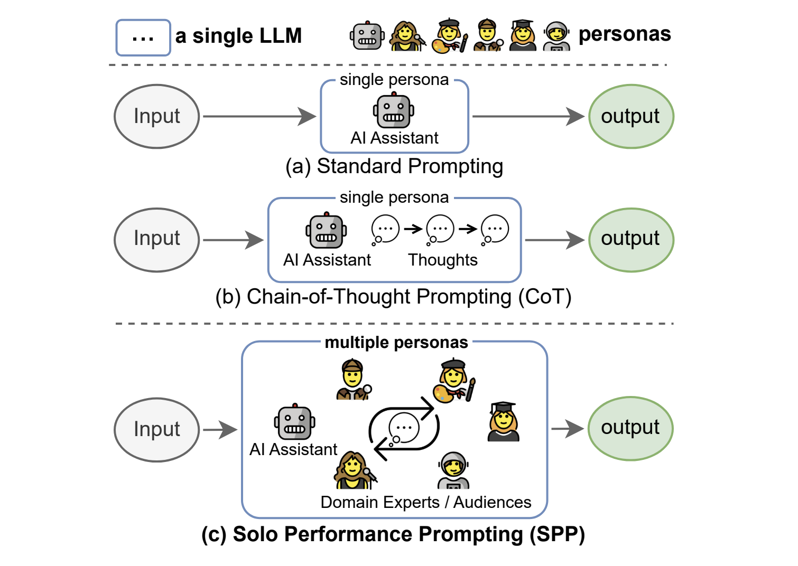

## Solo Performance Prompting (SPP)
Solo Performance Prompting (SPP) is a specialized version of role prompting in which the model takes on multiple personas using a zero-shot prompting methodology.

### How to use it
SPP is a more complex prompting style and involves outlining a multi-turn example prior to passing in the primary instruction to the model.

[See "Prompting" section for usage details](#prompting).

### When to use it
!!! tip "When to use Solo Performance Prompting"
    - When you want to simulate multi-agent collaboration using a single language model, without the need for additional models or resources.
    - When you want more transparency into the model's steps in producing a final answer.
    - When you need to solve complex tasks that require knowledge from multiple domains or perspectives.
    - When you aim to enhance both knowledge elicitation and reasoning capabilities of the model.
    - Try using it with reasoning-intensive tasks like logic puzzles, games, or trivia.

### What to know
SPP is a novel prompting approach that enables a single language model to identify, simulate, and collaborate with multiple personas to solve tasks effectively by engaging in multi-turn self-collaboration.

The key insight behind SPP is that simulating a multi-persona dialogue allows the model to elicit more relevant knowledge and incorporate diverse perspectives, leading to improved task-solving abilities. This is achieved through the single model playing the parts of different personas.

SPP has been shown to outperform standard prompting, chain-of-thought prompting, and self-refine prompting on both knowledge-intensive tasks (like trivia or creative writing) and reasoning-intensive tasks (logic grid puzzles) (Wang et al., 2023l).



### Best practices
!!! tip "Best practices for Solo Performance Prompting"
    - SPP provides two prompt format options: a basic format without examples and a detailed format that includes examples. When implementing SPP, consider starting with the prompt templates below and adapt them to your specific use case.
    - Do not assign specific, fixed roles to the language model for task completion. Instead let the model dynamically choose the personas based on the task.
    - For best results, use SPP with highly capable language models such as GPT-4, as they are more likely to exhibit the cognitive synergy abilities required for effective multi-persona collaboration.

### What to watch out for
!!! warning "What to watch out for with Solo Performance Prompting"
    - In my experiments conducted on a marketing plan task (see [prompt examples](#prompt-example) below), the detailed prompt format that included examples did not lead to better output quality compared to the shorter, simpler basic prompt format. Don't assume that including examples will always improve performance.
    - SPP increases both the input and output token count compared to more straightforward prompting methods. This can result in increased cost and higher latency.
    - Because the model responds with the resulting dialogue as well as the final answer it may not be suitable for all use cases; for instance, if the output is meant to be an input to a follow-up language model task additional parsing logic will be required to extract the final answer.

### Citations
Wang, Z., Mao, S., Wu, W., Ge, T., Wei, F., & Ji, H. (2023). Unleashing the Emergent Cognitive Synergy in Large Language Models: A Task-Solving Agent through Multi-Persona Self-Collaboration. [arXiv preprint arXiv:2307.05300](https://arxiv.org/pdf/2307.05300).

### Prompting
#### Prompt template
To create an SPP prompt start with a direction to use a multi-turn collaboration approach (basic prompt format) or include an full multi-turn example (complex prompt format) before giving the model an instruction.
> {multi-turn collaboration example} <br>
> {instruction} <br>

#### Prompt example
##### Basic prompt format
User prompt:
> When faced with a task, begin by identifying the participants who will contribute to solving the task. Then, initiate a multi-turn collaboration process until a final solution is reached. The participants will give critical comments and detailed suggestions whenever necessary. Now, identify the participants and collaboratively solve the following task step by step. Remember to present your final solution with the prefix 'Final answer:'.
>
> **Task:** Outline a marketing strategy for a new tech startup, MindWell AI. MindWell AI is a personalized mental health and wellness platform that leverages artificial intelligence to provide users with tailored mental health resources, therapy sessions, mindfulness exercises, and daily well-being check-ins. The platform offers a combination of AI-driven chatbots for initial interactions and licensed therapists for more in-depth sessions.

Model response (ChatGPT 4o):
> **Identifying the Participants:**
>
> 1. **Marketing Manager**: Responsible for overseeing the marketing strategy and ensuring it aligns with company goals.
> 2. **Content Strategist**: Develops content that resonates with the target audience and communicates the value of MindWell AI.
> 3. **Social Media Manager**: Manages social media campaigns and engages with the online community.
> 4. **SEO Specialist**: Ensures that MindWell AI ranks highly on search engines and attracts organic traffic.
> 5. **Product Manager**: Provides insights on product features and benefits to highlight in marketing materials.
> 6. **Data Analyst**: Analyzes market trends and user data to inform marketing strategies.
> 7. **Creative Director**: Oversees the design and visual aspects of the marketing campaigns.
> 8. **Customer Support Lead**: Provides feedback from users to refine marketing messages and address potential concerns.
>
> **Step-by-Step Collaborative Process:**
>
> **Step 1: Define Target Audience**
>
> **Marketing Manager**: "We need to clearly define our target audience. Who will benefit the most from MindWell AI?"
>
> **Content Strategist**: "We should focus on individuals seeking mental health support, including those experiencing mild to moderate mental health issues, people interested in mindfulness and wellness, and those looking for convenient, AI-driven mental health resources."
>
> **Data Analyst**: "Based on market research, our primary audience includes young professionals (ages 25-40), students, and individuals in high-stress occupations."
>
> **Step 2: Develop Unique Value Proposition (UVP)**
>
> **Product Manager**: "Our UVP should highlight the combination of AI-driven initial interactions and access to licensed therapists, emphasizing personalized care and convenience."
>
> **Creative Director**: "Visually, we can represent this through contrasting images of technology and human interaction, showing the seamless transition from chatbot to therapist."
>
> **Content Strategist**: "Let's craft a message that underscores the importance of accessible mental health resources and how MindWell AI makes this possible anytime, anywhere."
>
> **Step 3: Create Content Strategy**
>
> **Content Strategist**: "We'll develop a content calendar with blog posts, video content, social media updates, and email newsletters. Topics will include mental health tips, success stories, therapist insights, and app feature highlights."
>
> **Social Media Manager**: "For social media, we can use platforms like Instagram, Twitter, and LinkedIn to reach our audience. We should create engaging posts, run mental health awareness campaigns, and collaborate with influencers."
>
> **SEO Specialist**: "We need to optimize our content with relevant keywords like 'AI mental health app,' 'personalized therapy,' and 'mindfulness exercises.' This will improve our search engine ranking."
>
> **Step 4: Launch Promotional Campaigns**
>
> **Marketing Manager**: "We should plan a series of promotional campaigns to create buzz around our launch. This includes pre-launch teasers, launch day events, and post-launch follow-ups."
>
> **Creative Director**: "We can design eye-catching visuals for these campaigns, including graphics, videos, and interactive content that showcase the app's features and benefits."
>
> **Data Analyst**: "Let's use data from our beta testing phase to identify the most effective promotional channels and refine our campaigns accordingly."
>
> **Step 5: Measure and Optimize**
>
> **Customer Support Lead**: "We'll gather feedback from early users to identify any issues or areas for improvement. This feedback will be crucial for our marketing messages."
>
> **Data Analyst**: "We'll set up analytics to track the performance of our campaigns. Metrics like user acquisition, engagement rates, and customer satisfaction will help us gauge success and make necessary adjustments."
>
> **Marketing Manager**: "Regularly reviewing these metrics will allow us to optimize our strategy, ensuring we're effectively reaching and converting our target audience."
>
> **Final answer:**
>
> **Marketing Strategy for MindWell AI:**
>
> 1. **Target Audience**:
>     - Young professionals (ages 25-40)
>     - Students
>     - Individuals in high-stress occupations
> 2. **Unique Value Proposition (UVP)**:
>     - Combines AI-driven initial interactions with access to licensed therapists
>     - Offers personalized care and convenience
>     - Emphasizes accessible mental health resources available anytime, anywhere
> 3. **Content Strategy**:
>     - Develop a content calendar featuring blog posts, videos, social media updates, and newsletters
>     - Topics include mental health tips, success stories, therapist insights, and app features
>     - Utilize social media platforms like Instagram, Twitter, and LinkedIn
>     - Collaborate with influencers for mental health awareness campaigns
>     - Optimize content with relevant keywords for SEO
> 4. **Promotional Campaigns**:
>     - Pre-launch teasers, launch day events, and post-launch follow-ups
>     - Design visually appealing graphics, videos, and interactive content
>     - Use beta testing data to identify effective promotional channels
> 5. **Measure and Optimize**:
>     - Gather user feedback to refine marketing messages
>     - Set up analytics to track user acquisition, engagement rates, and customer satisfaction
>     - Regularly review metrics to optimize strategy and ensure effective audience reach and conversion.


##### Detailed prompt format
User prompt:
> When faced with a task, begin by identifying the participants who will contribute to solving the task. Then, initiate a multi-round collaboration process until a final solution is reached. The participants will
give critical comments and detailed suggestions whenever necessary.
>
> **Example Task**: Write a poem that meets the following requirements: (1) the poem has seven lines and the first letters of each line forms the word "CHATGPT"; (2) the poem is about explaining what is a quantum computer. (3) the poem needs to be easy to understand by a ten years old kid.
> 
> Participants: AI Assistant (you); Poet; Computer Scientist; Ten year old child
> 
> Poet: Make sure that you write the poem with seven lines, and the first letters of the lines should be C, H, A, T, G, P, T.
> Computer Scientist: A quantum computer is an advanced computing device that uses the principles of quantum mechanics to process and store information. Unlike classical computers that use bits to represent information as 0s and 1s, quantum computers use quantum bits or qubits. Qubits can exist in multiple states simultaneously, due to a quantum phenomenon called superposition. You can consider using these information for the poem.
> Ten year old child: I hope the poem to be fun and easy to understanding. I don't want to see a lot of jargons or complicated concepts.
> AI Assistant (you): Thanks for the guidance! Here's my initial attempt at the poem:
>
> _Computational wonder of our age,_ <br>
> _Harnessing the quantum world's strange ways,_ <br>
> _Atoms dance, entwined in dual state,_ <br>
> _Tapping secrets hidden in their haze._ <br>

> _Grand power to solve, simulate,_ <br>
> _Profound problems that perplex the wise,_ <br>
> _Transforming our future, we await._ <br>
> 
> Poet: Let's verify if the poem meets the requirements. The first letters are CHATGPT which is correct! And the poem rhymes well. Good job!
> Computer Scientist: Everything looks good to me!
> Ten year old child: I don't know what does perplex mean. Can you make the use of words easier to understand?
> AI Assistant (you): Sure, let me revise the poem by using more common words. Check out the revised version:
>
> _Curious machine of our time,_ <br>
> _Harnessing the quantum realm's odd ways,_ <br>
> _Atoms play, two states they embrace,_ <br>
> _Taking secrets from their puzzling maze._ <br>
> 
> _Great power to solve and imitate,_ <br>
> _Problems that confuse the brightest minds,_ <br>
> _Transforming our future, we await._ <br>
> 
> Poet: Let's check again if the poem meets the requirements. The first letters are C H A T G P T. And now the poem is more accessible to children. Everything looks good to me.
> Computer Scientist: Looking good!
> Ten year old child: I like this version a lot!
> 
> Finish collaboration!
> 
> Final answer:
>
> _Curious machine of our time,_ <br>
> _Harnessing the quantum realm's odd ways,_ <br>
> _Atoms play, two states they embrace,_ <br>
> _Taking secrets from their puzzling maze._ <br>
> _Great power to solve and imitate,_ <br>
> _Problems that confuse the brightest minds,_ <br>
> _Transforming our future, we await._ <br>
> 
> Now, identify the participants and collaboratively solve the following task step by step.
>
>**Task**: Outline a marketing strategy for a new tech startup, MindWell AI. MindWell AI is a personalized mental health and wellness platform that leverages artificial intelligence to provide users with tailored mental health resources, therapy sessions, mindfulness exercises, and daily well-being check-ins. The platform offers a combination of AI-driven chatbots for initial interactions and licensed therapists for more in-depth sessions.

Model response (ChatGPT 4o):
> **Participants:**
> 
> 1. **AI Assistant (you)**
> 2. **Marketing Expert**
> 3. **Mental Health Professional**
> 4. **Tech Enthusiast**
> 5. **Potential User**
> 
> **Step 1: Initial Contributions**
> 
> **AI Assistant:** Let's start by outlining the core components of the marketing strategy. We'll need to cover target audience identification, branding, digital marketing channels, content strategy, partnerships, and metrics for success.
> 
> **Marketing Expert:** We should focus on creating a strong brand identity and digital presence. This includes a compelling value proposition, a well-designed website, active social media engagement, and targeted advertising. Identifying the primary target audience is crucial for effective marketing.
> 
> **Mental Health Professional:** It's important to emphasize the credibility and efficacy of MindWell AI. Highlighting the qualifications of licensed therapists and the evidence-based approach to mental health care will build trust with potential users.
> 
> **Tech Enthusiast:** Showcasing the innovative technology behind MindWell AI can attract tech-savvy users. This includes explaining how AI-driven chatbots work, ensuring user data privacy, and demonstrating the seamless integration of AI and human therapists.
> 
> **Potential User:** I want to know how MindWell AI can help me personally. Testimonials, user stories, and a clear explanation of how the platform works will be very convincing. Free trials or demos could also be enticing.
> 
> **Step 2: Collaboration and Refinement**
> 
> **AI Assistant:** Based on the initial contributions, here’s a draft outline for the marketing strategy:
> 
> 1. **Target Audience Identification:**
>     - Young adults (18-35) seeking mental health support.
>     - Professionals dealing with workplace stress.
>     - Individuals interested in mindfulness and self-care.
> 
> 2. **Branding:**
>     - Value Proposition: "Personalized mental health support anytime, anywhere."
>     - Brand Personality: Trustworthy, empathetic, innovative.
> 
> 3. **Digital Marketing Channels:**
>     - Website: Informative, user-friendly, and visually appealing.
>     - Social Media: Active presence on platforms like Instagram, Twitter, and LinkedIn.
>     - Email Marketing: Regular newsletters with mental health tips and platform updates.
>     - Search Engine Optimization (SEO): To improve organic search visibility.
> 
> 4. **Content Strategy:**
>     - Blog: Articles on mental health topics, mindfulness, and user stories.
>     - Video Content: Therapist Q&A sessions, mindfulness exercise tutorials.
>     - Webinars: Live sessions with mental health professionals and AI experts.
> 
> 5. **Partnerships:**
>     - Collaborations with mental health organizations and influencers.
>     - Corporate partnerships for employee wellness programs.
> 
> 6. **Metrics for Success:**
>     - User acquisition and retention rates.
>     - Engagement metrics (website traffic, social media interactions).
>     - Conversion rates from free trials to paid subscriptions.
>     - User satisfaction and feedback.
> 
> **Marketing Expert:** The outline looks comprehensive. We should also consider running targeted ads on social media and search engines to reach our audience effectively. A referral program could incentivize users to invite their friends.
> 
> **Mental Health Professional:** We need to ensure that all content is sensitive and respectful to mental health issues. Regular feedback from users and mental health professionals will help maintain high standards.
> 
> **Tech Enthusiast:** Highlighting the technology's benefits, like data privacy and 24/7 availability, will be crucial. A section on the website dedicated to explaining the tech behind MindWell AI can build credibility.
> 
> **Potential User:** I like the idea of free trials and user stories. Maybe include some interactive elements on the website, like a quiz to personalize the user experience from the start.
> 
> **Step 3: Final Refinements**
> 
> **AI Assistant:** Incorporating all feedback, here’s the refined marketing strategy outline:
> 
> 1. **Target Audience Identification:**
>     - Young adults (18-35), professionals, mindfulness enthusiasts.
>
> 2. **Branding:**
>     - Value Proposition: "Personalized mental health support anytime, anywhere."
>     - Brand Personality: Trustworthy, empathetic, innovative.
>
> 3. **Digital Marketing Channels:**
>     - Website: Informative, user-friendly, visually appealing.
>     - Social Media: Active presence on Instagram, Twitter, LinkedIn.
>     - Email Marketing: Regular newsletters with mental health tips and updates.
>     - SEO: To improve organic search visibility.
>     - Targeted Ads: Social media and search engine ads.
>
> 4. **Content Strategy:**
>     - Blog: Articles on mental health, mindfulness, user stories.
>     - Video Content: Therapist Q&A sessions, mindfulness tutorials.
>     - Webinars: Live sessions with mental health professionals and AI experts.
>     - Interactive Elements: Quizzes for personalized experiences.
>
> 5. **Partnerships:**
>     - Collaborations with mental health organizations and influencers.
>     - Corporate partnerships for employee wellness programs.
>     - Referral Program: Incentivize users to invite friends.
>
> 6. **Metrics for Success:**
>     - User acquisition and retention rates.
>     - Engagement metrics (website traffic, social media interactions).
>     - Conversion rates from free trials to paid subscriptions.
>     - User satisfaction and feedback.
> 
> **Marketing Expert:** This looks solid. Implementing these strategies should effectively raise awareness and attract users to MindWell AI.
> 
> **Mental Health Professional:** Agreed. Emphasizing the credibility and efficacy of the platform is key.
> 
> **Tech Enthusiast:** The focus on technology benefits and data privacy will resonate well with users.
> 
> **Potential User:** This strategy is clear and engaging. I'm excited to see how MindWell AI will help users like me!
> 
> **Final Marketing Strategy Outline:**
> 
> 1. **Target Audience Identification:**
>     - Young adults (18-35), professionals, mindfulness enthusiasts.
> 
> 2. **Branding:**
>     - Value Proposition: "Personalized mental health support anytime, anywhere."
>     - Brand Personality: Trustworthy, empathetic, innovative.
> 
> 3. **Digital Marketing Channels:**
>     - Website: Informative, user-friendly, visually appealing.
>     - Social Media: Active presence on Instagram, Twitter, LinkedIn.
>     - Email Marketing: Regular newsletters with mental health tips and updates.
>     - SEO: To improve organic search visibility.
>     - Targeted Ads: Social media and search engine ads.
> 
> 4. **Content Strategy:**
>     - Blog: Articles on mental health, mindfulness, user stories.
>     - Video Content: Therapist Q&A sessions, mindfulness tutorials.
>     - Webinars: Live sessions with mental health professionals and AI experts.
>     - Interactive Elements: Quizzes for personalized experiences.
> 
> 5. **Partnerships:**
>     - Collaborations with mental health organizations and influencers.
>     - Corporate partnerships for employee wellness programs.
>     - Referral Program: Incentivize users to invite friends.
> 
> 6. **Metrics for Success:**
>     - User acquisition and retention rates.
>     - Engagement metrics (website traffic, social media interactions).
>     - Conversion rates from free trials to paid subscriptions.
>     - User satisfaction and feedback.

#### API example
```python
from openai import OpenAI

# Set your API key
client = OpenAI(
    # This is the default and can be omitted
    api_key=os.environ.get("OPENAI_API_KEY"),
)

system_prompt = "When faced with a task, begin by identifying the participants who will contribute to solving the task. Then, initiate a multi-turn collaboration process until a final solution is reached. The participants will give critical comments and detailed suggestions whenever necessary. Now, identify the participants and collaboratively solve the following task step by step. Remember to present your final solution with the prefix 'Final answer:'."

user_prompt = "Task: Outline a marketing strategy for a new tech startup, MindWell AI. MindWell AI is a personalized mental health and wellness platform that leverages artificial intelligence to provide users with tailored mental health resources, therapy sessions, mindfulness exercises, and daily well-being check-ins. The platform offers a combination of AI-driven chatbots for initial interactions and licensed therapists for more in-depth sessions."

completion = openai.ChatCompletion.create(
  model="gpt-3.5-turbo",
  messages=[
    {"role": "system", "content": system_prompt},
    {"role": "user", "content": user_prompt}
  ]
)

# Print the response from the model
print(completion.choices[0].message.content)
```
